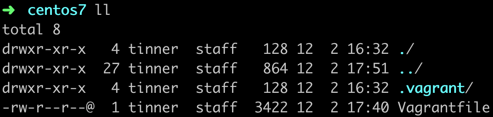
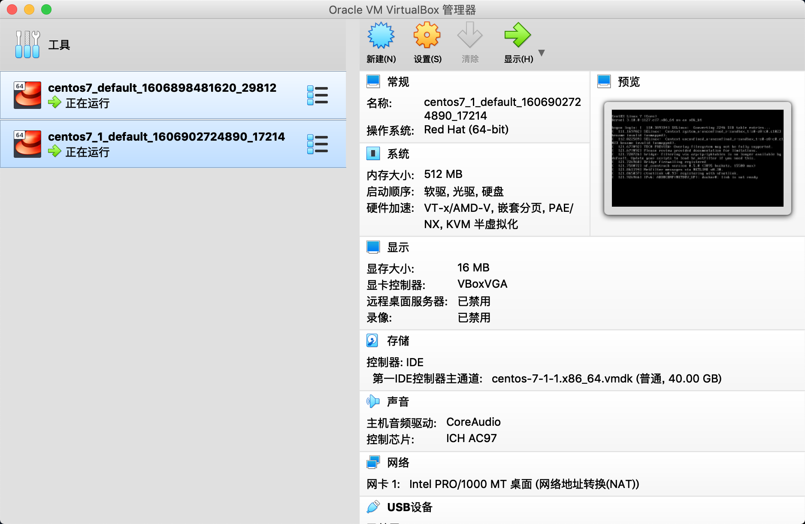
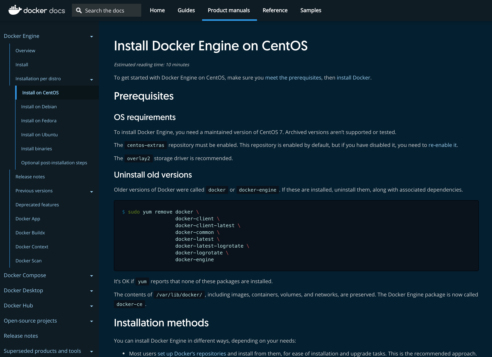
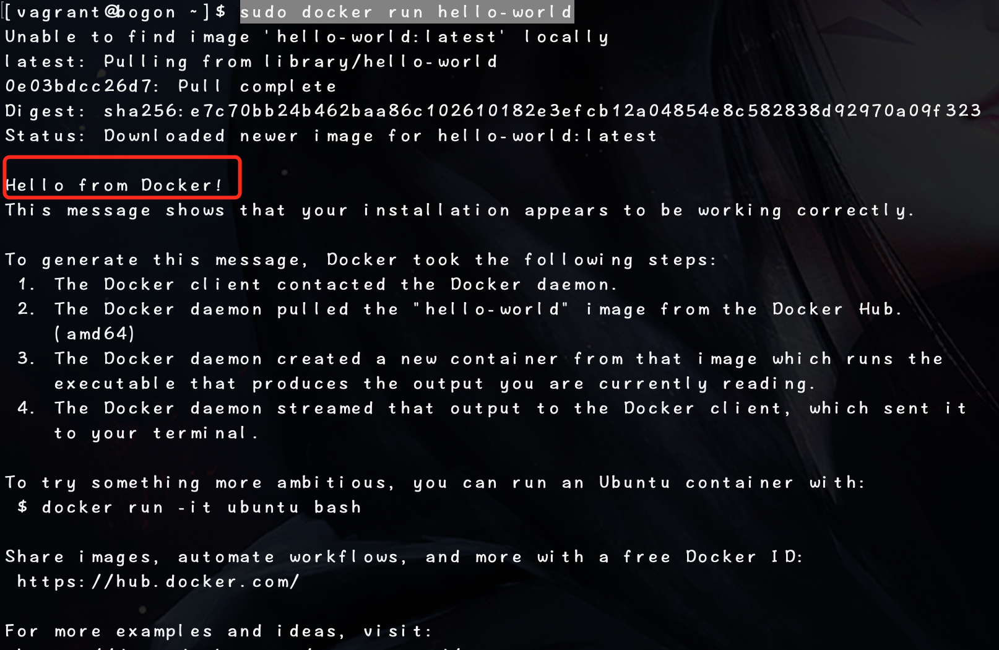

<meta name="referrer" content="no-referrer" />

### 一、安装虚拟机

##### 安装vagrant

[安装vagrant](https://www.vagrantup.com/)

根据自己的电脑操作系统选择最新版本进行安装即可

##### 安装virtualbox

[安装virtualbox](https://www.virtualbox.org/wiki/Downloads)

**vagrant用于构建虚拟机，virtualbox相当于是一个虚拟机管理工具**

  

##### 相关命令

依次执行如下命令：
```
cd local
mkdir centos7
vagrant init centos/7
```
即可在当前目录下看到有一个`Vagrantfile`文件生成

然后运行`vagrant up`命令进行构建虚拟机（需要有点耐心）

构建完毕会在当前目录下生成一个文件夹：



然后在virtualbox程序中，会有相应的虚拟机生成：



### 二、安装Docker

参考官方文档：[Docker官方文档](https://docs.docker.com/)



#### 命令

在当前文件夹下，使用命令`vagrant ssh`进入构建出来的虚拟机，然后执行如下命令构建Docker：
```
sudo yum remove docker docker-client docker-client-latest docker-common docker-latest docker-latest-logrotate docker-logrotate docker-engine
sudo yum install -y yum-utils
sudo yum-config-manager     --add-repo     https://download.docker.com/linux/centos/docker-ce.repo
sudo yum install docker-ce docker-ce-cli containerd.io
sudo systemctl start docker
```
到此为止，docker就创建成功并且启动了
运行命令:
```
sudo docker run hello-world
```
可以看到如下信息


将vagrant添加到docker用户组中
```
sudo groupadd docker
sudo gpasswd -a vagrant docker
sudo service docker restart
exit
```
重启之后，再次`vagrant ssh`进入虚拟机，运行docker命令就不必加sudo了

### 三、vagrant相关命令

|命令|含义|
|:---:|:---:|
|vagrant init|初始化|
|vagrant up|启动虚拟机|
|vagrant halt|关闭虚拟机|
|vagrant reload|重启虚拟机|
|vagrant ssh|SSH至虚拟机|
|vagrant suspend|挂起虚拟机|
|vagrant resume|唤醒虚拟机|
|vagrant status|查看虚拟机运行状态|
|vagrant destroy|销毁当前虚拟机|
|vagrant box list|查看本地box列表|
|vagrant box add|添加box到列表|
|vagrant box remove|从box列表移除

### 四、彩蛋

在我们运行`vagrant init centos/7`之后，就可以看到在当前目录下生成了`Vagrantfile`文件

我们可以在运行`vagrant up`的时候即可让虚拟机构建出一个Docker环境，需要修改`Vagrantfile`文件
如下：
```
# -*- mode: ruby -*-
# vi: set ft=ruby :

# All Vagrant configuration is done below. The "2" in Vagrant.configure
# configures the configuration version (we support older styles for
# backwards compatibility). Please don't change it unless you know what
# you're doing.
Vagrant.configure("2") do |config|
  # The most common configuration options are documented and commented below.
  # For a complete reference, please see the online documentation at
  # https://docs.vagrantup.com.

  # Every Vagrant development environment requires a box. You can search for
  # boxes at https://vagrantcloud.com/search.
  config.vm.box = "centos/7"

  # Disable automatic box update checking. If you disable this, then
  # boxes will only be checked for updates when the user runs
  # `vagrant box outdated`. This is not recommended.
  # config.vm.box_check_update = false

  # Create a forwarded port mapping which allows access to a specific port
  # within the machine from a port on the host machine. In the example below,
  # accessing "localhost:8080" will access port 80 on the guest machine.
  # NOTE: This will enable public access to the opened port
  # config.vm.network "forwarded_port", guest: 80, host: 8080

  # Create a forwarded port mapping which allows access to a specific port
  # within the machine from a port on the host machine and only allow access
  # via 127.0.0.1 to disable public access
  # config.vm.network "forwarded_port", guest: 80, host: 8080, host_ip: "127.0.0.1"

  # Create a private network, which allows host-only access to the machine
  # using a specific IP.
  # config.vm.network "private_network", ip: "192.168.33.10"

  # Create a public network, which generally matched to bridged network.
  # Bridged networks make the machine appear as another physical device on
  # your network.
  # config.vm.network "public_network"

  # Share an additional folder to the guest VM. The first argument is
  # the path on the host to the actual folder. The second argument is
  # the path on the guest to mount the folder. And the optional third
  # argument is a set of non-required options.
  # config.vm.synced_folder "../data", "/vagrant_data"

  # Provider-specific configuration so you can fine-tune various
  # backing providers for Vagrant. These expose provider-specific options.
  # Example for VirtualBox:
  #
  # config.vm.provider "virtualbox" do |vb|
  #   # Display the VirtualBox GUI when booting the machine
  #   vb.gui = true
  #
  #   # Customize the amount of memory on the VM:
  #   vb.memory = "1024"
  # end
  #
  # View the documentation for the provider you are using for more
  # information on available options.

  # Enable provisioning with a shell script. Additional provisioners such as
  # Ansible, Chef, Docker, Puppet and Salt are also available. Please see the
  # documentation for more information about their specific syntax and use.
  # config.vm.provision "shell", inline: <<-SHELL
  #   apt-get update
  #   apt-get install -y apache2

  config.vm.provision "shell", inline: <<-SHELL
  sudo yum remove docker docker-client docker-client-latest docker-common docker-latest docker-latest-logrotate docker-logrotate docker-engine
  sudo yum install -y yum-utils
  sudo yum-config-manager -y --add-repo https://download.docker.com/linux/centos/docker-ce.repo
  sudo yum -y install docker-ce docker-ce-cli containerd.io
  sudo systemctl start docker
  SHELL
end
```
