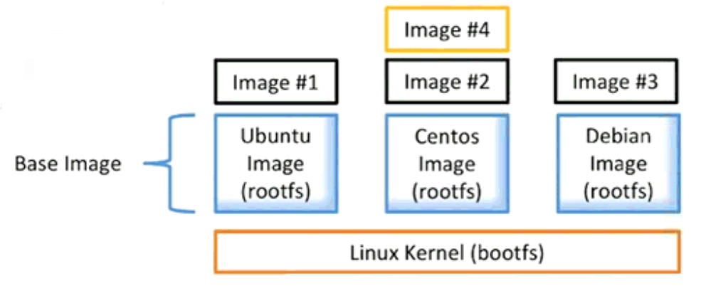
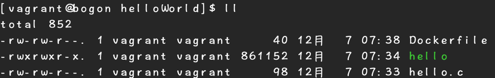
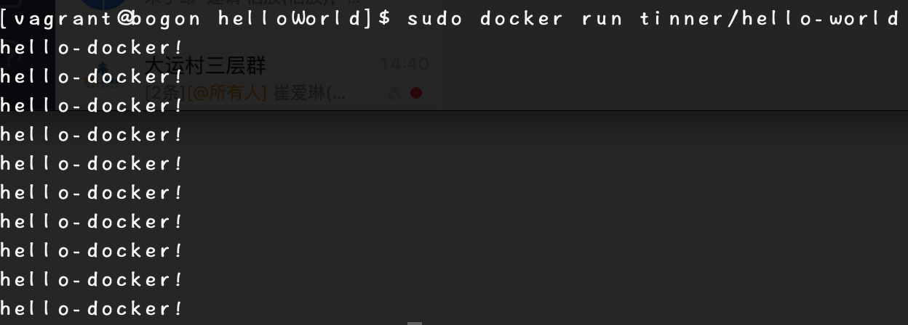

<meta name="referrer" content="no-referrer" />

### 什么是Image

- 文件和meta data的集合（root filesystem）
- 分层的，并且每一层都可以添加改变删除文件，成为一个新的image
- 不同的image可以共享相同的layer
- Image本身是read-only的



<!--More-->

### Image的获取

- 通过Dockerfile构建
- 从[docker Registry](https://hub.docker.com/)获取

### 创建一个helloword-Image

先安装编译C语言的相关环境，然后在当前目录下，创建helloWorld文件夹，然后新建`hello.c`文件
```
sudo yum install -y vim
sudo yum install -y gcc
sudo yum install glibc-static
vim hello.c
```
然后在hello.c中，编写c语言程序
```
sudo yum install glib-static
#include<stdio.h>

int main()
{
int i = 0;
for(;i< 10; i ++)
	{
		printf("hello-docker!\n");
	}
}
```
然后编译：`gcc -static hello.c -o hello`,，可以在当前目录下看到多了一个hello的可执行文件

之后编辑`Dockerfile`文件
```
FROM scratch
ADD hello /
CMD ["/hello"]
```

然后进行build，运行
```
sudo docker build -t tinner/hello-world .
sudo docker run tinner/hello-world
```
即可看到输出：
