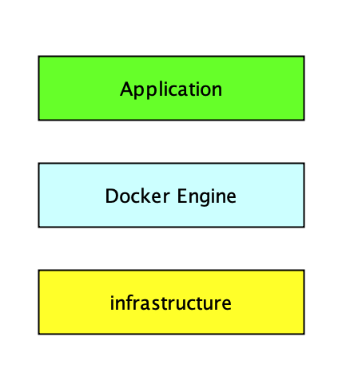
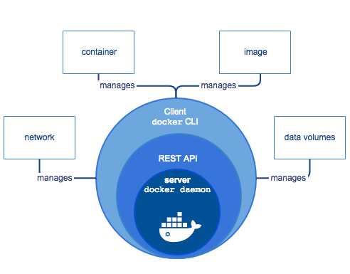

<meta name="referrer" content="no-referrer" />

### Docker Platform

Docker提供了一个开发、打包、运行app的平台

它将app和底层infrastructure隔离开来

<!--More-->

### Docker Engine

Docker Engine 是一个 client-server 应用，它主要有以下几个部分构成：
- 后台进程（dockerd）它是一个长期运行的程序，称之为 daemon process。
- REST API server：程序可以通过这些 API 与 daemon 进行通信和指示 daemon 要做什么。
- CLI接口（docker）：docker 指令。

CLI 使用 Docker REST API，然后直接通过脚本或者 CLI 命令来控制或者与 Docker daemon 进行交互。

Docker daemon 用于创建和管理 Docker 对象，如 images、containers、networks 以及 volumes。

### 底层技术支持

Namespaces：做隔离pid、net、ipc、mnt、uts

Control groups：做资源限制

Union file systems：Container和image的分层