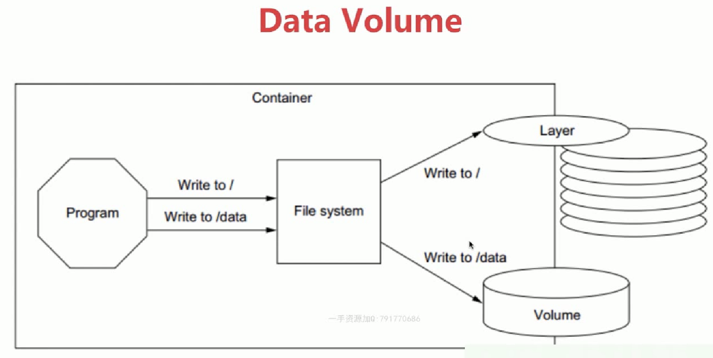
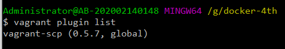
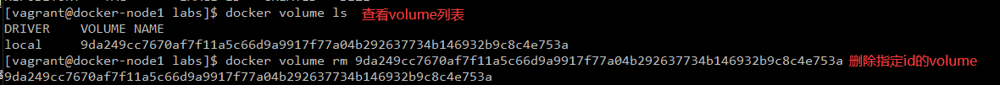
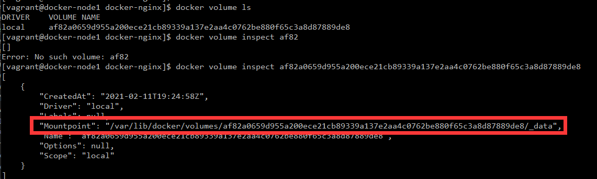
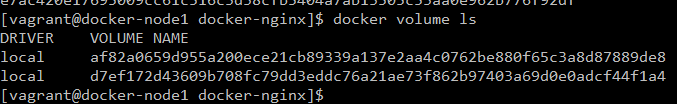
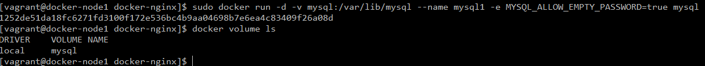
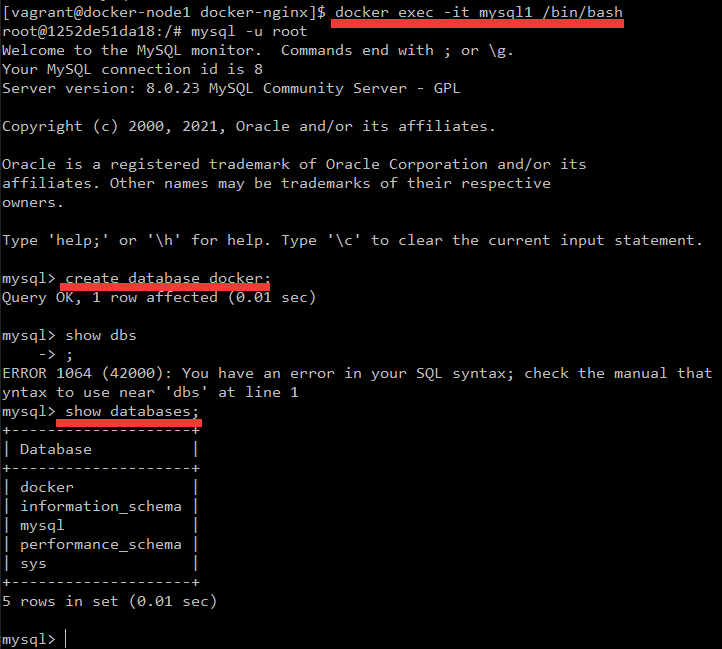
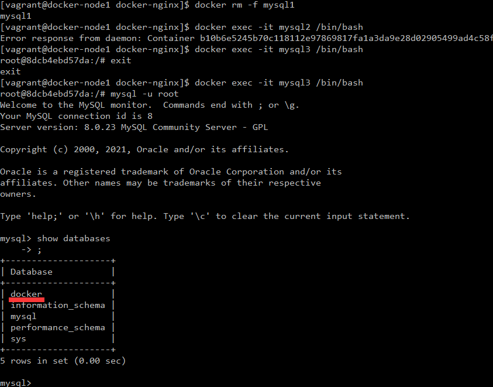
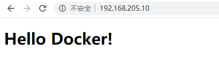

<meta name="referrer" content="no-referrer" />


**问题**

当我创建了一个容器，在这个容器中我有个mysql服务，在这个mysql里面我有各种各样的数据。但是有一天我一不小心删除了这个容器，那么这个容器中的相关服务以及数据也都没有了。这个时候就出问题了。

我们需要一种数据持久化机制来实现我们容器中数据的存储。



默认情况下docker数据是写在了container里面的，当我们将容器删除掉之后是找不到这个容器里面的文件及恢复的，那么我们可以用一种机制类似于mock的方式去将容器中的数据保存在我们的磁盘上，这样就跟容器隔离开了，进而实现数据持久化。

<!--More-->

### Docker持久化数据的两种方案

- 基于本地文件系统的Volume。可以在执行Docker create或Docker run时，通过-v参数将主机的目录作为容器的数据卷。这部分功能便是基于本地文件系统的volume管理。
- 基于plugin的Volume，支持第三方的存储方案，比如NAS、aws

### Volume的类型
- 受管理的data Volome，由docker后台自动创建
- 绑定挂载的Volome，具体挂载的位置可以由用户指定

#### 小插曲

我需要从我本地拷贝几份文件到vagrant的虚拟机中，需要安装vagrant的scp插件`vagrant plugin install scp`。



- 将本地文件拷贝到虚拟机指定目录中
```
vagrant scp <目标文件夹路径> vmName:<虚拟机内文件夹路径>
```
- 注意：<虚拟机内文件夹路径>需要预先开通777权限
```
sudo chmod 777 <虚拟机内文件夹路径>
```

### Data Volume


1.进入虚拟机，查看volume：



2.创建一个不需要密码登录的mysql应用
```
sudo docker run -d --name mysql1 -e MYSQL_ALLOW_EMPTY_PASSWORD=true mysql
```
3.查看volume相关信息

可以看到它这个volume映射到了虚拟机内部的路径上去

4.再去创建另一个mysql
```
sudo docker run -d --name mysql2 -e MYSQL_ALLOW_EMPTY_PASSWORD=true mysql
```
再去查看volume可以看到多了一个


5.现在我去停止并且remove掉两个容器
```
docker rm -f mysql1 mysql2
```
可以发现但是他们的volume还在


**但是又有第二个问题，我们的volume的名字并不是特别友好， 我可以给volume起个别名**

6.删除这两个volume
```
docker volume rm <id>
```

7.重新创建，指定别名为mysql
```
sudo docker run -d -v mysql:/var/lib/mysql --name mysql1 -e MYSQL_ALLOW_EMPTY_PASSWORD=true mysql
```


可以看到有一个mysql的volume

我们的数据都会同步到这个volume里面去

##### 验证

- 进入到mysql1中
```
sudo docker exec -it mysql1 /bin/bash
mysql -u root
create database docker;
show databases;
```


- 然后退出容器
- 强制删除mysql1
- 创建mysql3，使用这个volume
```
sudo docker run -d -v mysql:/var/lib/mysql --name mysql3 -e MYSQL_ALLOW_EMPTY_PASSWORD=true mysql
```
- 进入容器，可以看到mysql3中有docker这个数据库



### bind Mounting做地址映射

只需要在运行容器的时候去指定我们本地的目录和容器的目录的一一对应关系，通过这种方式可以去同步，让我们本地的目录文件和容器的目录文件是同步的。本质是同一个文件同一个目录做映射。

我这里有个脚本文件Dockerfile

```
# this same shows how we can extend/change an existing official image from Docker Hub

FROM nginx:latest
# highly recommend you always pin versions for anything beyond dev/learn

WORKDIR /usr/share/nginx/html
# change working directory to root of nginx webhost
# using WORKDIR is prefered to using 'RUN cd /some/path'

COPY index.html index.html

# I don't have to specify EXPOSE or CMD because they're in my FROM
```

其实就是创建一个nginx服务，然后将我自定义的index.html覆盖到nginx中
构建：
```
docker build -t tinner/mynginx .
```
做端口映射：
```
 docker run -d -p 80:80 --name web tinner/mynginx
```
然后curl 127.0.0.1
可以看到首页就是我写的index.html
```
<!doctype html>
<html lang="en">
<head>
  <meta charset="utf-8">

  <title>hello</title>

</head>

<body>
  <h1>Hello Docker! </h1>
</body>
</html>
```
在本地输入(我的虚拟机ip)：http://192.168.205.10/，同样也能看到自定义页面


然后删除这个容器
```
docker rm -f web
```

#### 用bind Mounting进行映射

```
docker run -d -v $(pwd):/usr/share/nginx/html -p 80:80 --name web tinner/mynginx
```

主要是-v参数，$(pwd)就是我当前虚拟机的目录，冒号后面就是我创建出来的容器的指定目录要与$(pwd)目录进行映射。

然后进入容器
```
 docker exec -it web /bin/bash
 touch docker.txt
```
退出容器，可以看到在虚拟机内部也生成了一个docker.txt文件，同时在我本地也有一份

这是因为我在构建vagrant的时候指定了
```
Vagrant.require_version ">= 1.6.0"

boxes = [
    {
        :name => "docker-host",
        :eth1 => "192.168.205.31",
        :mem => "1024",
        :cpu => "1"
    }
]

Vagrant.configure(2) do |config|

  config.vm.box = "centos/7"
  boxes.each do |opts|
    config.vm.define opts[:name] do |config|
      config.vm.hostname = opts[:name]
      config.vm.provider "vmware_fusion" do |v|
        v.vmx["memsize"] = opts[:mem]
        v.vmx["numvcpus"] = opts[:cpu]
      end
      config.vm.provider "virtualbox" do |v|
        v.customize ["modifyvm", :id, "--memory", opts[:mem]]
        v.customize ["modifyvm", :id, "--cpus", opts[:cpu]]
      end
      config.vm.network :private_network, ip: opts[:eth1]
    end
  end
  config.vm.synced_folder "./labs", "/home/vagrant/labs"
  config.vm.provision "shell", privileged: true, path: "./setup.sh"
end
```

在倒数第三行，进行了文件的映射，将本地的labs文件夹映射到了我构建出来的虚拟机的"/home/vagrant/labs"目录下，同时，在虚拟机中构建nginx容器的时候，也指定了文件映射，这三处地方实现了映射，进而实现了数据的存储
```
config.vm.synced_folder "./labs", "/home/vagrant/labs"
```
同时，用这种方式可以实现在我们开发过程中同步查看一些改动