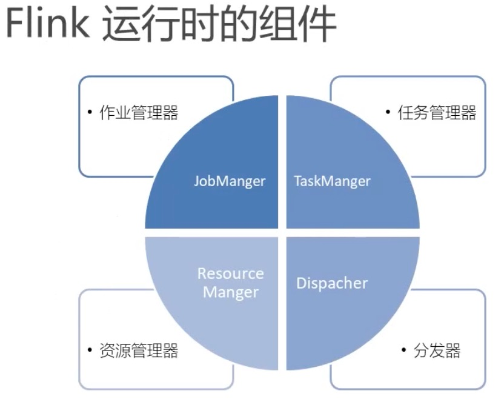
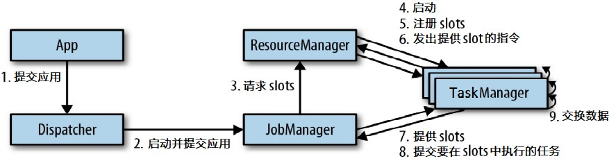
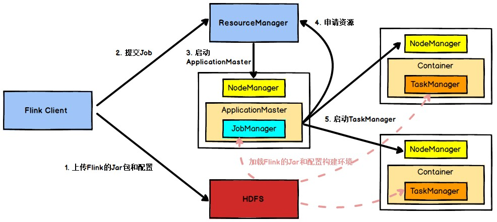
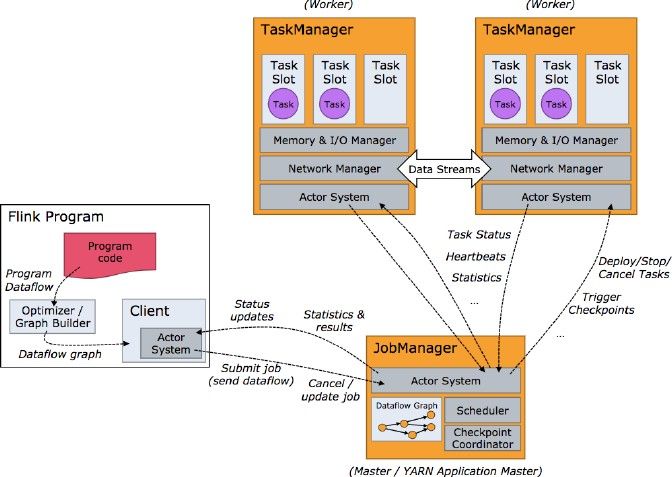

<meta name="referrer" content="no-referrer" />

# 一、Flink运行架构

## 1.Flink运行时的组件

Flink 运行时架构主要包括四个不同的组件，它们会在运行流处理应用程序时协同工作： 作业管理器（JobManager）、资源管理器（ResourceManager）、任务管理器（TaskManager）， 以及分发器（Dispatcher）。因为 Flink 是用 Java 和 Scala 实现的，所以所有组件都会运行在Java 虚拟机上。每个组件的职责如下：

 

- **JobManager:** 控制一个应用程序执行的主进程，也就是说， 每个应用程序都会被一个不同的JobManager 所控制执行。JobManager 会先接收到要执行的应用程序，这个应用程序会包括： 作业图（JobGraph）、逻辑数据流图（logical dataflow graph）和打包了所有的类、库和其它资源的 JAR 包。JobManager 会把 JobGraph 转换成一个物理层面的数据流图，这个图被叫做“执行图”（ExecutionGraph），包含了所有可以并发执行的任务。JobManager 会向资源管理器（ResourceManager）请求执行任务必要的资源，也就是任务管理器（TaskManager）上的插槽（ slot）。一旦它获取到了足够的资源，就会将执行图分发到真正运行它们的TaskManager 上。而在运行过程中，JobManager 会负责所有需要中央协调的操作，比如说检查点（checkpoints）的协调。
- **TaskManager:** Flink 中的工作进程。通常在 Flink 中会有多个 TaskManager 运行，每一个 TaskManager
都包含了一定数量的插槽（slots）。插槽的数量限制了 TaskManager 能够执行的任务数量。启动之后， TaskManager 会向资源管理器注册它的插槽；收到资源管理器的指令后， TaskManager 就会将一个或者多个插槽提供给 JobManager 调用。JobManager 就可以向插槽分配任务（tasks）来执行了。在执行过程中，一个TaskManager 可以跟其它运行同一应用程序的 TaskManager 交换数据。
- **ResourceManager:** 主要负责管理任务管理器（TaskManager）的插槽（slot），Slot是 Flink 中定义的处理资源单元。Flink 为不同的环境和资源管理工具提供了不同资源管理器，比如YARN、Mesos、K8s，以及 standalone 部署。当 JobManager 申请插槽资源时，ResourceManager 会将有空闲插槽的TaskManager 分配给 JobManager。如果 ResourceManager 没有足够的插槽来满足 JobManager 的请求，它还可以向资源提供平台发起会话，以提供启动 TaskManager 进程的容器。另外，ResourceManager 还负责终止空闲的 TaskManager，释放计算资源。
- **Dispacher:** 分发器，可以跨作业运行，它为应用提交提供了 REST 接口。当一个应用被提交执行时，分发器就会启动并将应用移交给一个 JobManager。由于是 REST 接口，所以 Dispatcher 可以作为集群的一个 HTTP 接入点，这样就能够不受防火墙阻挡。Dispatcher 也会启动一个 Web UI，用来方便地展示和监控作业执行的信息。Dispatcher 在架构中可能并不是必需的，这取决于应用提交运行的方式。

## 2.任务提交流程

我们来看看当一个应用提交执行时，Flink 的各个组件是如何交互协作的：

上图是从一个较为高层级的视角，来看应用中各组件的交互协作。如果部署的集群环境不同（例如 YARN，Mesos，Kubernetes，standalone 等），其中一些步骤可以被省略，或是有些组件会运行在同一个 JVM 进程中。

具体地，如果我们将 Flink 集群部署到 YARN 上，那么就会有如下的提交流程：

Flink 任务提交后， Client 向 HDFS 上传 Flink 的 Jar 包和配置， 之后向 Yarn ResourceManager 提交任务， ResourceManager 分配 Container 资源并通知对应的NodeManager 启动 ApplicationMaster， ApplicationMaster 启动后加载 Flink 的 Jar 包和配置构建环境，然后启动 JobManager，之后 ApplicationMaster 向 ResourceManager 申请资源启动 TaskManager ， ResourceManager 分配 Container  资 源 后 ， 由ApplicationMaster 通 知 资 源 所 在 节 点 的 NodeManager 启动 TaskManager ， NodeManager 加载 Flink 的 Jar 包和配置构建环境并启动 TaskManager，TaskManager 启动后向 JobManager 发送心跳包， 并等待 JobManager 向其分配任务。

## 3.任务调度原理

- 客户端不是运行时和程序执行的一部分，但它用于准备并发送dataflow(JobGraph)给 Master(JobManager)， 然后， 客户端断开连接或者维持连接以等待接收计算结果。

- 当Flink集群启动后,首先会启动`一个JobManger和一个或多个的TaskManager`。由`Client`提交任务给`JobManager`,JobManager再调度任务到各个TaskManager去执行，然后`TaskManager`将心跳和统计信息汇报给`JobManager`。`TaskManager`之间以流的形式进行数据的传输。上述三者均为独立的 JVM 进程。
- `Client`为提交Job的客户端，可以是运行在任何机器上（ 与 JobManager 环境连通即可）。提交 Job 后， Client 可以结束进程（ Streaming 的任务），也可以不结束并等待结果返回。
- `JobManager`主要负责调度Job并协调`Task`做`checkpoint`(职责上很像Storm的Nimbus)。从Client处接收到Job和JAR包等资源后，会生成优化后的执行计划，并以Task的单元调度到各个`TaskManager`去执行。
- `TaskManager`在启动的时候就设置好了槽位数（`Slot`），每个`slot`能启动一个Task,Task为线程。从`JobManager`处接收需要部署的Task，部署启动后，与自己的上游建立Netty连接,接收数据并处理。

