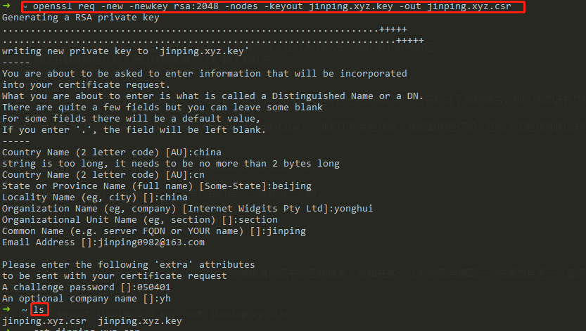
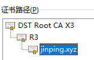

<meta name="referrer" content="no-referrer" />
HTTP请求都是明文传输的，所谓的明文指的是没有经过加密的信息，如果HTTP请求被黑客拦截，并且里面含有银行卡密码等敏感数据的话，会非常危险。为了解决这个问题，Netscape 公司制定了HTTPS协议，HTTPS可以将数据加密传输，也就是传输的是密文，即便黑客在传输过程中拦截到数据也无法破译，这就保证了网络通信的安全。

# 一.密码学基础

## 明文

明文指的是未被加密过的原始数据

## 密文

明文被某种加密算法加密之后，会变成密文，从而确保原始数据的安全。密文也可以被解密，得到原始的明文。

## 密钥

密钥是一种参数，它是在明文转换为密文或将密文转换为明文的算法中输入的参数。密钥分为`对称密钥`与`非对称密钥`，分别应用在对称加密和非对称加密上。

## 对称加密

对称加密又叫做私钥加密，即信息的发送方和接收方使用同一个密钥去加密和解密数据。对称加密的特点是算法公开、加密和解密速度快，适合于对大数据量进行加密，常见的对称加密算法有DES、3DES、TDEA、Blowfish、RC5和IDEA。
- 加密：明文+加密算法+私钥--->密文
- 解密：密文+解密算法+私钥--->明文
  
其加密过程中的私钥与解密过程中用到的私钥是同一个密钥，这也是称加密之所以称之为“对称”的原因。由于对称加密的算法是公开的，所以一旦私钥被泄露，那么密文就很容易被破解，所以对称加密的缺点是密钥安全管理困难。

## 非对称加密

非对称加密也叫做公钥加密。非对称加密与对称加密相比，其安全性更好。对称加密的通信双方使用相同的密钥，如果一方的密钥遭泄露，那么整个通信就会被破解。而非对称加密使用一对密钥，即`公钥`和`私钥`，且二者成对出现。

私钥被自己保存，不能对外泄露。
公钥指的是公共的密钥，任何人都可以获得该密钥。
用公钥或私钥中的任何一个进行加密，用另一个进行解密。
**公钥和私钥是一一对应的**
被公钥加密过的密文只能被私钥解密，过程如下：
- 明文 + 加密算法 + 公钥 ---> 密文， 密文 + 解密算法 + 私钥 ---> 明文

被私钥加密过的密文只能被公钥解密，过程如下：
- 明文 + 加密算法 + 私钥 ---> 密文， 密文 + 解密算法 + 公钥 ---> 明文

由于加密和解密使用了两个不同的密钥，这就是非对称加密“非对称”的原因。
非对称加密的缺点是加密和解密花费时间长、速度慢，只适合对少量数据进行加密。
在非对称加密中使用的主要算法有：RSA、Elgamal、Rabin、D-H、ECC（椭圆曲线加密算法）等。

# 二.HTTPS通信过程
**HTTPS协议 = HTTP协议 + SSL/TLS协议**，在HTTPS数据传输的过程中，需要用SSL/TLS对数据进行加密和解密，需要用HTTP对加密后的数据进行传输，由此可以看出HTTPS是由HTTP和SSL/TLS一起合作完成的。

SSL的全称是Secure Sockets Layer，即安全套接层协议，是为网络通信提供安全及数据完整性的一种安全协议。SSL协议在1994年被Netscape发明，后来各个浏览器均支持SSL，其最新的版本是3.0

TLS的全称是Transport Layer Security，即安全传输层协议，最新版本的TLS（Transport Layer Security，传输层安全协议）是IETF（Internet Engineering Task Force，Internet工程任务组）制定的一种新的协议，它建立在SSL 3.0协议规范之上，是SSL 3.0的后续版本。在TLS与SSL3.0之间存在着显著的差别，主要是它们所支持的加密算法不同，所以TLS与SSL3.0不能互操作。虽然TLS与SSL3.0在加密算法上不同，但是在我们理解HTTPS的过程中，我们可以把SSL和TLS看做是同一个协议。

HTTPS为了兼顾安全与效率，**同时使用了对称加密和非对称加密**。数据是被对称加密传输的，对称加密过程需要客户端的一个密钥，为了确保能把该密钥安全传输到服务器端，采用非对称加密对该密钥进行加密传输，总的来说，**对数据进行对称加密，对称加密所要使用的密钥通过非对称加密传输。**


HTTPS在传输的过程中会涉及到三个密钥：
- 服务器端的公钥和私钥，用来进行非对称加密
- 客户端生成的随机密钥，用来进行对称加密

一个HTTPS请求实际上包含了两次HTTP传输，可以细分为8步：
1. 客户端向服务器发起HTTPS请求，连接到服务器的443端口
2. 服务器端有一个密钥对，即公钥和私钥，是用来进行非对称加密使用的，服务器端保存着私钥，不能将其泄露，公钥可以发送给任何人。
3. 服务器将自己的公钥发送给客户端。
4. 客户端收到服务器端的证书之后，会对证书进行检查，验证其合法性，如果发现发现证书有问题，那么HTTPS传输就无法继续。严格的说，这里应该是验证服务器发送的数字证书的合法性。如果公钥合格，那么客户端会生成一个随机值，这个随机值就是用于进行对称加密的密钥，我们将该密钥称之为`client key`，即客户端密钥。然后**用服务器的公钥对客户端密钥进行非对称加密**，这样客户端密钥就变成密文了，至此，HTTPS中的第一次HTTP请求结束。
5. 客户端会发起HTTPS中的第二个HTTP请求，将加密之后的客户端密钥发送给服务器。
6. 服务器接收到客户端发来的密文之后，会用自己的私钥对其进行非对称解密，解密之后的明文就是客户端密钥，然后用客户端密钥对数据进行对称加密，这样数据就变成了密文。
7. 然后服务器将加密后的密文发送给客户端。
8. 客户端收到服务器发送来的密文，用客户端密钥对其进行对称解密，得到服务器发送的数据。这样HTTPS中的第二个HTTP请求结束，整个HTTPS传输完成。

# 三.CA

CA是Certification Authority的缩写，它代表世界上那些权威的证书颁发机构。

## 1.CA需要做什么

CA 要验证这个域名真的是你的：通常就是通过 DNS 记录或者就是你在指定 URI 下放置一个特殊文件，让 CA 可以在外网环境下访问到它。
CA 是一个非常关键的角色，因为它签出来的任何证书都是被信任的，所以这要求每个 CA 都不能乱来。

Let's Encrypt 机构提供了免费的证书，那有什么区别呢？
Let's Encrypt 它只验证了这个域名是你的，然后就可以给你免费签发证书，这个证书的有效期是 3 个月，到期要自己去更新。因为它只验证了你的域名，所以这类证书又称为 DV 证书（Domain Validation）。

而一些收费的 CA 可以签发 OV 证书（Organization Validation）或 EV 证书（Extended Validation），他们不仅会验证这个域名真的是你的，还会人工验证你的公司是否符合他们的各项签发标准，所以收费也比较贵。通常这些证书的有效期是 1 年。

对于浏览器来说，通常会根据你的证书是 DV 还是 OV，来呈现不同的样式，所以有一种花钱的证书更香的感觉。

但是从技术上来说，它们都是提供一样的保护级别的，在最新的 Chrome 上，它没有区别对待，一律显示一个锁。

## 2.证书申请

首先我们要生成一个 CSR，它的全称是 Certificate Signing Request，这个文件包含了你要申请的证书的各种信息，这和在某个 CA 的后台填写一个申请表单是一个意思，只是这样可以规范所有 CA 遵守一致的规则。
这里我们需要使用一个叫 openssl 的软件，执行下面的命令：
```
openssl req -new -newkey rsa:2048 -nodes -keyout jinping.xyz.key -out jinping.xyz.csr
```

进入交互界面后，需要你填写国家、城市、公司名字、部门名字、申请的域名、邮箱地址。有些 CA 支持中文，大部分不支持，这里建议都是用英文字符。

然后我们就会得到两个文本文件：
```
jinping.xyz.csr  
jinping.xyz.key
```
其中一个是 CSR 文件，用来发给 CA 申请证书的，另一个是私钥。私钥需要好好保存，等证书申请完成以后要用。
从域名的角度，证书分为单域名、通配符域名、多域名证书。以单域名 jinping.xyz 为例子，通配符和多域名也很好理解，在填写域名的时候按照格式填就可以了。
生成出来的 jinping.xyz.csr 文件，它的内容是这样的
```
-----BEGIN CERTIFICATE REQUEST-----
MIIC+TCCAeECAQAwgYkxCzAJBgNVBAYTAmNuMRAwDgYDVQQIDAdiZWlqaW5nMQ4w
DAYDVQQHDAVjaGluYTEQMA4GA1UECgwHeW9uZ2h1aTEQMA4GA1UECwwHc2VjdGlv
bjEQMA4GA1UEAwwHamlucGluZzEiMCAGCSqGSIb3DQEJARYTamlucGluZzA5ODJA
MTYzLmNvbTCCASIwDQYJKoZIhvcNAQEBBQADggEPADCCAQoCggEBANC5kvprdmFm
gk+W0Fw1Co+kj2h97jj5ibZtoytUyq3nlHEXdrXMqnsz1sR4mBa3J8qbQZ2FkEB4
ShU7gynTS+zlI7Vq7tU29TC1vZGhNUo3TlhSj412VXxjImlCvh+gAhQbHkkFsMlv
n3YNphdlI/Du36jYcecJ1J4CznY6RYdPstbqBeltVuREFZL6gr34n8WDRlU333pI
jONMnwFa8JVmQO/6TOvJn7xfc9HMdq7Uvz7RLk0mOdCY8NfW5603/IoFxQ5YaLGh
ULb9v0omprxGiTm+keC0m6LB3Y0JFZdkOwyGkznEsLJ+vZ7NA11YGKKb4zmLjNg1
pQp1aavWxBECAwEAAaAqMBEGCSqGSIb3DQEJAjEEDAJ5aDAVBgkqhkiG9w0BCQcx
CAwGMDUwNDAxMA0GCSqGSIb3DQEBCwUAA4IBAQBvL6QvPB+weRBudlPTEYv4GEY3
I5JxhdxAB57wWzDmn96xRuChlPMyRHd6XiMXM2nnv02GCNDyPP6Zx6C80rQFbNvz
qa9298wGhFX2jRFXVW/Z1zsdn1sXk2B3Pa7dW0FEgAN+uc+CbV2HALdtRvAiFxvc
enWm9aMShhk2rpl0NPZ1Xa5bY0zM+Ew3Qq/W0zCuJVLuV+7Rf8CRP1RNZD7FoEST
miKvBTE0fG0WAjdPmXznAfbraP/cljdMk+Ccn9tQ+SgCfa5aedXPAFxgs1KW1LJ3
vi6X5Jvoz0BhABNPz3xVYGqOV82/UR+MP5PVZvbXO6lWLghmXj2twSwH4pXy
-----END CERTIFICATE REQUEST-----
```
进入 https://decoder.link/result 进行 decode，可以得到：
```
Certificate Request:
    Data:
        Version: 1 (0x0)
        Subject: C = cn, ST = beijing, L = china, O = yonghui, OU = section, CN = jinping, emailAddress = jinping0982@163.com
        Subject Public Key Info:
            Public Key Algorithm: rsaEncryption
                Public-Key: (2048 bit)
                Modulus:
                    00:d0:b9:92:fa:6b:76:61:66:82:4f:96:d0:5c:35:
                    0a:8f:a4:8f:68:7d:ee:38:f9:89:b6:6d:a3:2b:54:
                    ca:ad:e7:94:71:17:76:b5:cc:aa:7b:33:d6:c4:78:
                    98:16:b7:27:ca:9b:41:9d:85:90:40:78:4a:15:3b:
                    83:29:d3:4b:ec:e5:23:b5:6a:ee:d5:36:f5:30:b5:
                    bd:91:a1:35:4a:37:4e:58:52:8f:8d:76:55:7c:63:
                    22:69:42:be:1f:a0:02:14:1b:1e:49:05:b0:c9:6f:
                    9f:76:0d:a6:17:65:23:f0:ee:df:a8:d8:71:e7:09:
                    d4:9e:02:ce:76:3a:45:87:4f:b2:d6:ea:05:e9:6d:
                    56:e4:44:15:92:fa:82:bd:f8:9f:c5:83:46:55:37:
                    df:7a:48:8c:e3:4c:9f:01:5a:f0:95:66:40:ef:fa:
                    4c:eb:c9:9f:bc:5f:73:d1:cc:76:ae:d4:bf:3e:d1:
                    2e:4d:26:39:d0:98:f0:d7:d6:e7:ad:37:fc:8a:05:
                    c5:0e:58:68:b1:a1:50:b6:fd:bf:4a:26:a6:bc:46:
                    89:39:be:91:e0:b4:9b:a2:c1:dd:8d:09:15:97:64:
                    3b:0c:86:93:39:c4:b0:b2:7e:bd:9e:cd:03:5d:58:
                    18:a2:9b:e3:39:8b:8c:d8:35:a5:0a:75:69:ab:d6:
                    c4:11
                Exponent: 65537 (0x10001)
        Attributes:
            unstructuredName         :yh
            challengePassword        :050401
    Signature Algorithm: sha256WithRSAEncryption
         6f:2f:a4:2f:3c:1f:b0:79:10:6e:76:53:d3:11:8b:f8:18:46:
         37:23:92:71:85:dc:40:07:9e:f0:5b:30:e6:9f:de:b1:46:e0:
         a1:94:f3:32:44:77:7a:5e:23:17:33:69:e7:bf:4d:86:08:d0:
         f2:3c:fe:99:c7:a0:bc:d2:b4:05:6c:db:f3:a9:af:76:f7:cc:
         06:84:55:f6:8d:11:57:55:6f:d9:d7:3b:1d:9f:5b:17:93:60:
         77:3d:ae:dd:5b:41:44:80:03:7e:b9:cf:82:6d:5d:87:00:b7:
         6d:46:f0:22:17:1b:dc:7a:75:a6:f5:a3:12:86:19:36:ae:99:
         74:34:f6:75:5d:ae:5b:63:4c:cc:f8:4c:37:42:af:d6:d3:30:
         ae:25:52:ee:57:ee:d1:7f:c0:91:3f:54:4d:64:3e:c5:a0:44:
         93:9a:22:af:05:31:34:7c:6d:16:02:37:4f:99:7c:e7:01:f6:
         eb:68:ff:dc:96:37:4c:93:e0:9c:9f:db:50:f9:28:02:7d:ae:
         5a:79:d5:cf:00:5c:60:b3:52:96:d4:b2:77:be:2e:97:e4:9b:
         e8:cf:40:61:00:13:4f:cf:7c:55:60:6a:8e:57:cd:bf:51:1f:
         8c:3f:93:d5:66:f6:d7:3b:a9:56:2e:08:66:5e:3d:ad:c1:2c:
         07:e2:95:f2
```
主要包含三部分：
- 第一部分：Subject 中是我填写的域名的基本信息，这里面，我们只需要关注 CN 字段就行：jinping。CN 是 Common Name 的缩写。
- 第二部分：Subject Public Key Info 是公钥部分，这里指定了服务器使用的加密算法是 RSA，公钥长度是 2048 位。
- 第三部分：签名，使用了 `sha256WithRSAEncryption` 算法。也就是说首先将上面的所有信息进行 sha256 散列得到 hash 值，然后使用 RSA 算法对 hash 值进行加密，而加密的秘钥就是之前生成的私钥。

> 为什么这里要加第三部分的签名？其实就是为了防止你的 CSR 文件在发给 CA 的过程中被中间人拦截，然后修改了里面的信息再发给 CA。
CA 的校验过程是：利用里面的公钥将签名进行解密得到里面的散列值，然后 CA 也会利用 CSR 里面的信息计算一遍散列值，如果两者相等，那么说明证书没有被中间人修改过，反之就是被修改过

## 3.证书组成

CA 收到我们的 CSR 文件以后，CA 会进行审核，前面说过了，审核这个域名是不是你的，如果需要，还有人工审核公司信息。审核通过后，它就会发给我们证书文件了，每家 CA 出来的文件名可能略有不同，但是表达的信息是一样的。

主要有以下几个文件：

域名证书：jinping.xyz.pem 或叫 cert.pem
证书链：fullchain.pem
这些文件可能是 .pem 也可能是 .crt 后缀，但都是文本文件，可以直接打开查看它们的信息：

域名证书的文件内容通常是这样的：
```
-----BEGIN CERTIFICATE-----
MIIFTzCCBDegAwIBAgISAy4b8ie6L/ACCJt/V7x/OR0iMA0GCSqGSIb3DQEBCwUA
MEoxCzAJBgNVBAYTAlVTMRYwFAYDVQQKEw1MZXQncyBFbmNyeXB0MSMwIQYDVQQD
......
Ecbqh4AoB33mZhp9ptJb1N1RSlZREI0FlbX0kUd6VowKUPhH8Iex6jxQpJHwRkpq
YJaWKrUxGWuJurOcN7b3HXn6yw==
-----END CERTIFICATE-----
```
证书链文件通常是这样的：(证书链文件的第一部分，和证书文件的内容是一模一样的。)
```
-----BEGIN CERTIFICATE-----
MIIFTzCCBDegAwIBAgISAy4b8ie6L/ACCJt/V7x/OR0iMA0GCSqGSIb3DQEBCwUA
MEoxCzAJBgNVBAYTAlVTMRYwFAYDVQQKEw1MZXQncyBFbmNyeXB0MSMwIQYDVQQD
.......
Ecbqh4AoB33mZhp9ptJb1N1RSlZREI0FlbX0kUd6VowKUPhH8Iex6jxQpJHwRkpq
YJaWKrUxGWuJurOcN7b3HXn6yw==
-----END CERTIFICATE-----
-----BEGIN CERTIFICATE-----
MIIEkjCCA3qgAwIBAgIQCgFBQgAAAVOFc2oLheynCDANBgkqhkiG9w0BAQsFADA/
MSQwIgYDVQQKExtEaWdpdGFsIFNpZ25hdHVyZSBUcnVzdCBDby4xFzAVBgNVBAMT
.......
PfZ+G6Z6h7mjem0Y+iWlkYcV4PIWL1iwBi8saCbGS5jN2p8M+X+Q7UNKEkROb3N6
KOqkqm57TH2H3eDJAkSnh6/DNFu0Qg==
-----END CERTIFICATE-----
```

> 如果 CA 还给你发了 chain.pem 文件，其实它的内容肯定就是证书链文件内容裁减掉第一部分的证书内容而已。

我们需要的其实就是一个证书链。CA 给我们颁发的证书，其实就是一个证书链文件

## 4.文件内容

decode后的结果：
```
Certificate:
    Data:
        Version: 3 (0x2)
        Serial Number:
            02:ac:5c:26:6a:0b:40:9b:8f:0b:79:f2:ae:46:25:77
    Signature Algorithm: sha1WithRSAEncryption
        //证书颁发机构
        Issuer: C = US, O = DigiCert Inc, OU = www.digicert.com, CN = DigiCert High Assurance EV Root CA
        //证书有效期
        Validity
            Not Before: Nov 10 00:00:00 2006 GMT
            Not After : Nov 10 00:00:00 2031 GMT
        // 证书申请信息
        Subject: C = US, O = DigiCert Inc, OU = www.digicert.com, CN = DigiCert High Assurance EV Root CA
        // 公钥
        Subject Public Key Info:
            Public Key Algorithm: rsaEncryption
                Public-Key: (2048 bit)
                Modulus:
                    00:c6:cc:e5:73:e6:fb:d4:bb:e5:2d:2d:32:a6:df:
                    e5:81:3f:c9:cd:25:49:b6:71:2a:c3:d5:94:34:67:
                    a2:0a:1c:b0:5f:69:a6:40:b1:c4:b7:b2:8f:d0:98:
                    a4:a9:41:59:3a:d3:dc:94:d6:3c:db:74:38:a4:4a:
                    cc:4d:25:82:f7:4a:a5:53:12:38:ee:f3:49:6d:71:
                    91:7e:63:b6:ab:a6:5f:c3:a4:84:f8:4f:62:51:be:
                    f8:c5:ec:db:38:92:e3:06:e5:08:91:0c:c4:28:41:
                    55:fb:cb:5a:89:15:7e:71:e8:35:bf:4d:72:09:3d:
                    be:3a:38:50:5b:77:31:1b:8d:b3:c7:24:45:9a:a7:
                    ac:6d:00:14:5a:04:b7:ba:13:eb:51:0a:98:41:41:
                    22:4e:65:61:87:81:41:50:a6:79:5c:89:de:19:4a:
                    57:d5:2e:e6:5d:1c:53:2c:7e:98:cd:1a:06:16:a4:
                    68:73:d0:34:04:13:5c:a1:71:d3:5a:7c:55:db:5e:
                    64:e1:37:87:30:56:04:e5:11:b4:29:80:12:f1:79:
                    39:88:a2:02:11:7c:27:66:b7:88:b7:78:f2:ca:0a:
                    a8:38:ab:0a:64:c2:bf:66:5d:95:84:c1:a1:25:1e:
                    87:5d:1a:50:0b:20:12:cc:41:bb:6e:0b:51:38:b8:
                    4b:cb
                Exponent: 65537 (0x10001)
        // 这部分内容我们忽略
        X509v3 extensions:
            X509v3 Key Usage: critical
                Digital Signature, Certificate Sign, CRL Sign
            X509v3 Basic Constraints: critical
                CA:TRUE
            X509v3 Subject Key Identifier: 
                B1:3E:C3:69:03:F8:BF:47:01:D4:98:26:1A:08:02:EF:63:64:2B:C3
            X509v3 Authority Key Identifier: 
                keyid:B1:3E:C3:69:03:F8:BF:47:01:D4:98:26:1A:08:02:EF:63:64:2B:C3
    // 签名
    Signature Algorithm: sha1WithRSAEncryption
         1c:1a:06:97:dc:d7:9c:9f:3c:88:66:06:08:57:21:db:21:47:
         f8:2a:67:aa:bf:18:32:76:40:10:57:c1:8a:f3:7a:d9:11:65:
         8e:35:fa:9e:fc:45:b5:9e:d9:4c:31:4b:b8:91:e8:43:2c:8e:
         b3:78:ce:db:e3:53:79:71:d6:e5:21:94:01:da:55:87:9a:24:
         64:f6:8a:66:cc:de:9c:37:cd:a8:34:b1:69:9b:23:c8:9e:78:
         22:2b:70:43:e3:55:47:31:61:19:ef:58:c5:85:2f:4e:30:f6:
         a0:31:16:23:c8:e7:e2:65:16:33:cb:bf:1a:1b:a0:3d:f8:ca:
         5e:8b:31:8b:60:08:89:2d:0c:06:5c:52:b7:c4:f9:0a:98:d1:
         15:5f:9f:12:be:7c:36:63:38:bd:44:a4:7f:e4:26:2b:0a:c4:
         97:69:0d:e9:8c:e2:c0:10:57:b8:c8:76:12:91:55:f2:48:69:
         d8:bc:2a:02:5b:0f:44:d4:20:31:db:f4:ba:70:26:5d:90:60:
         9e:bc:4b:17:09:2f:b4:cb:1e:43:68:c9:07:27:c1:d2:5c:f7:
         ea:21:b9:68:12:9c:3c:9c:bf:9e:fc:80:5c:9b:63:cd:ec:47:
         aa:25:27:67:a0:37:f3:00:82:7d:54:d7:a9:f8:e9:2e:13:a3:
         77:e8:1f:4a
```
证书中主要包含：
- 证书颁发机构：用于寻找链中的下一个验证节点
- 证书的有效期：比如浏览器要根据这个值来判断证书是否已过期
- 证书申请信息：比如浏览器要判断改证书是否可用于当前访问的域名
- 公钥：用于后续和服务端通信的秘钥，这个公钥和当初生成 CSR 时的公钥是一个东西，因为只有它是和服务器的私钥是一对的
- 签名：用于验证证书内容没有被篡改

**这里简单说一说这个证书里面的公钥和签名：**

前面在介绍生成 CSR 的时候，我们说过了，签名部分，是服务器使用私钥加密 hash 值得到的，同时在 CSR 中包含了公钥，这样 CA 在收到这个文件后，可以用 CSR 文件中的公钥来解密签名，进而做校验。
而这里不一样，这个证书是 CA 给我们的，自然这个签名也是 CA 使用它自己的私钥进行加密的，但是这里的公钥是我们服务器的公钥，显然不能用于解密签名。
那对于用户浏览器来说，在收到这个证书以后，怎么校验这个证书的签名呢？显然浏览器需要得到 CA 的公钥。下一节我们就将详细描述这个过程。

# 四.HTTPS验证过程

下面将使用 jinping.xyz 这个域名的证书来分析。

首先，我们可以看到，这个证书链由 3 个证书组成。jinping.xyz 证书由中间证书 R3 签发，中间证书由 DST Root CA X3 签发，而 DST Root CA X3 是一个受信任的根证书。

流程如下：
1. 用户访问 https://jinping.xyz，服务器返回 CA 给的证书链，其中包含了 jinping.xyz 证书以及中间证书；
2. 浏览器首先需要判断 jinping.xyz 的证书是不是可信的，关键的一步就是要解密证书的签名部分。因为证书是由中间证书签发的，所以要用中间证书里面的公钥来进行解密；
3. 第 2 步初步判断了 jinping.xyz 的证书是合法的，但是，这个是基于中间证书合法的基础上来的，所以接下来要判断中间证书是否是合法的；
4. 根据中间证书里面的信息，可以知道它是由 DST Root CA X3 签发的，由于证书链只有两个节点，所以要到操作系统的根证书库中查找，由于这个证书是一个使用非常广泛的根证书，所以在系统中可以找到它。然后利用根证书的公钥来解密中间证书的签名部分，进而判断中间证书是否合法，如果合法，整个流程就通了

我们思考一下：
- 这个系统要工作好，关键就是最终一定要走到本地根证书库，一环验证一环，实现整个链路证书的可信任；
- 中间证书有多少层都可以，只要能一直传递到根证书就行；
- 本地的根证书是由操作系统内置的，如果你的使用场景中，根证书不在系统预装里面，需要手动导入根证书；
- 另外，我这里使用了操作系统内置这个说法，其实也不准确吧，各大浏览器厂商可以自己内置这个根证书库，这样我想信任谁就信任谁，而不是听 Microsoft、Apple... 这些操作系统厂商的。

脑洞大开一下，如果你想开一家 CA 公司，技术上是没什么成本的，但是你要说服各大操作系统、浏览器厂商，把你家的根证书内置到里面，这就有点难了。当然，还有另一条路可以走，那就是不要搞根证书，基于某个 CA 搞个中间证书，然后用这个中间证书去签发证书就可以了。