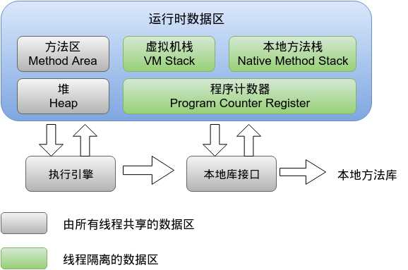

<meta name="referrer" content="no-referrer" />

Java虚拟机在执行Java程序的过程中会把它管理的内存分为若干个不同的数据区域。这些区域有着各自的用途，一级创建和销毁的时间，有的区域随着虚拟机进程的启动而存在，有些区域则依赖用户线程的启动和结束而建立和销毁。根据《Java虚拟机规范》中规定，jvm所管理的内存大致包括以下几个运行时数据区域，如图所示：

<!-- more -->

# 一.线程私有的

## 1.程序计数器

占据一块较小的内存空间，可以看做当前线程所执行的字节码的行号指示器。在虚拟机概念模型里，字节码解释器工作时就是通过改变这个计数器的值来选取下一条需要执行的字节码指令，分支，循环，跳转，异常处理，线程恢复等基础功能都需要依赖这个计数器来完成。

由于jvm的多线程是通过线程轮流切换并分配处理器执行时间的方式来实现的，在任何一个确定的时刻，一个处理器都只会执行一条线程中的指令。因此未来线程切换后能恢复到正确的执行位置，每条线程都需要有一个独立的程序计数器，各条线程之间计数器互不影响，独立存储，我们成这类内存区域为“线程私有”的内存。

- 如果线程正在执行的是一个Java方法，这个计数器记录的则是正在执行的虚拟机字节码指令的地址；
- 如果正在执行的是Native方法，这个计数器则为空（undefined）。

**此内存区域是唯一一个在Java虚拟机规范中没有规定任何OutOfMemoryError情况的区域。**

## 2.Java虚拟机栈

线程私有，生命周期和线程相同，虚拟机栈描述的是Java方法执行的内存模型，每个方法在执行的同时都会创建一个栈帧  用于存储局部变量表，操作数栈，动态链接，方法出口等信息。每一个方法从调用直至完成的过程，就对应着一个栈帧在虚拟机栈中入栈到出栈的过程。

局部变量表存放了编译期可知的各种基本类型数据（boolean、byte、char、short、int、float、long、double）、对象引用、returnAddress类型（指向了一条字节码指令的地址）。

其中64位长度的long和double类型的数据会占用2个局部变量表空间（slot），其余的数据类型只占用1个。局部变量表所需的内存空间在编译期完成分配，当进入一个方法时，这个方法所需要在栈帧中分配多大的局部变量空间是完全确定的，在方法运行期间不会改变局部变量表的大小。(大小指的是变量槽的数量)

在Java虚拟机规范中，对此区域规定了两种异常状况：

- 如果线程请求的栈深度大于虚拟机所允许的深度，将会抛出Stack OverflowError异常；
- 如果虚拟机栈可以动态扩展时无法申请到足够的内存，就会抛出OutOfMemoryError异常。

## 3.本地方法栈

本地方法栈与虚拟机栈所发挥的作用非常相似，他们之间的区别不过是虚拟机栈为虚拟机执行Java方法（字节码）服务，而本地方法栈则为虚拟机中使用到的native方法服务。在虚拟机规范中对本地方法栈中方法使用的语言、使用方式与数据结构并没有强制规定，因此具体的虚拟机可以自由实现它。甚至有的虚拟机直接把本地方法栈和虚拟机栈合二为一，

与虚拟机栈一样也会抛出Stack OverflowError异常和OutOfMemoryError异常。

# 二.线程共享的

## 1.Java堆

对于大多数应用来说，堆空间是jvm内存中最大的一块。Java堆是被所有线程共享，虚拟机启动时创建，此内存区域唯一的目的就是存放对象实例，几乎所有的对象实例都在这里分配内存。这一点在Java虚拟机规范中的描述是：所有的对象实例以及数组都要在堆上分配，但是随着JIT编译器的发展和逃逸分析技术逐渐成熟，栈上分配，标量替换优化技术将会导致一些微妙的变化发生，所有的对象都分配在堆上也就变得不那么绝对了。

Java堆是垃圾收集器管理的主要区域，因此很多时候也被称为“GC堆”。从内存回收角度看，由于现在收集器基本都采用分代收集算法，所以Java堆还可以细分为：新生代和老年代；再细致一点的有Eden空间，From Survivor空间，To Survivor空间等。从内存分配的角度来看，线程共享的Java堆中可能划分出多个线程私有的分配缓冲区。不过无论如何划分，都与存放内容无关，无论哪个区域，存储的都仍然是对象实例，进一步划分的目的是为了更好的回收内存，或者更快的分配内存。（如果在堆中没有内存完成实例分配，并且堆也无法再扩展时，将会抛出OutOfMemoryError异常。）

## 2.方法区（永久代）

和堆一样所有线程共享，主要用于存储已被jvm加载的类信息、常量、静态变量、即时编译器编译后的代码等数据。也叫“非堆”。

（在JDK1.7发布的HotSpot中，已经把字符串常量池移除方法区了。）

这个区域的内存回收目标主要是针对常量池的回收和对类型的卸载。

如果方法区无法满足新的内存分配需求时，将抛出OutOfMemoryError异常。

## 3.常量池

**运行时常量池是方法区的一部分**。Class文件中除了有类的版本、字段、方法、接口等描述信息外，还有一项信息是常量池，用于存放编译期生成的各种字面量和符号引用，这部分内容将在类加载后进入方法区的运行时常量池中存放。

Java虚拟机对class文件每一部分的格式都有严格规定，每一个字节用于存储哪种数据都必须符合规范才会被jvm认可。但对于运行时常量池，Java虚拟机规范没做任何细节要求。

运行时常量池有个重要特性是动态性，Java语言不要求常量一定只在编译期才能产生，也就是并非预置入class文件中常量池的内容才能进入方法区的运行时常量池，运行期间也有可能将新的常量放入池中，这种特性使用最多的是String类的intern()方法。

既然运行时常量池是方法区的一部分，自然受到方法区内存的限制。当常量池无法再申请到内存时会抛出outOfMemeryError异常。

## 4.直接内存

直接内存并不是虚拟机运行时数据区的一部分。但是这部分也被经常访问，而且也可能导致OOM异常。

在jdk1.4中新加入了NIO类，引入了一种基于通道（Channel）与缓冲区（Buffer）的I/O方式，它可以使用Native函数直接分配堆外内存，然后通过一个存储在Java堆里面的DirectByteBuffer对象作为这块内存的引用进行操作。这样能在一些场景中显著提高性能，因为避免了在Java堆和Native堆中来回复制数据。
