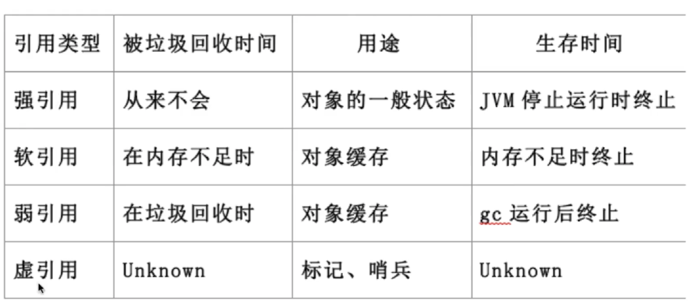
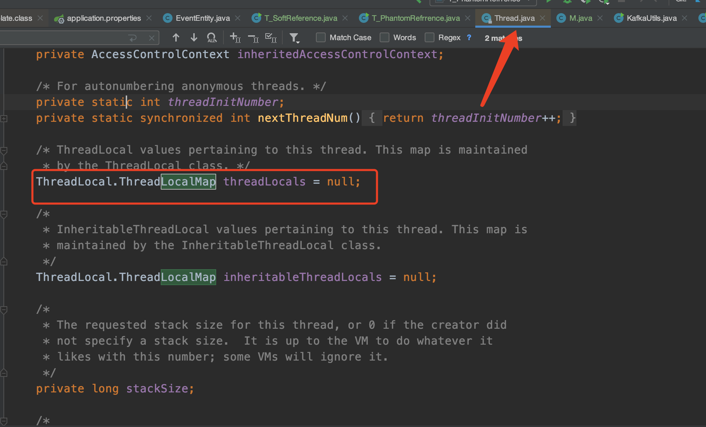
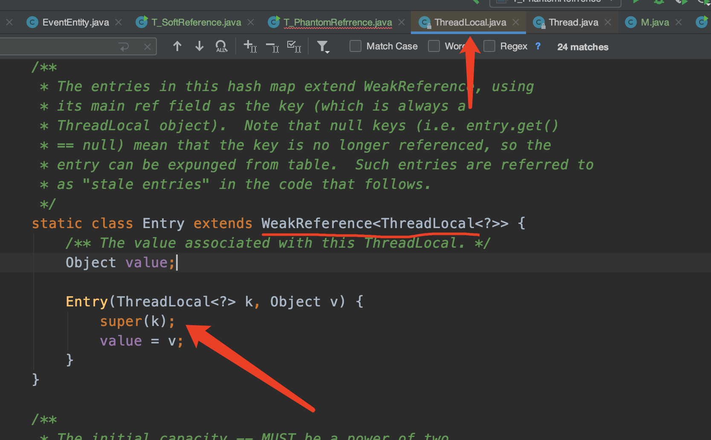

<meta name="referrer" content="no-referrer" />

Java里面有四种引用类型：强、软、弱、虚



## 一.强引用

就是我们普通的引用。作为一个垃圾来说，什么时候才会被回收呢？当一个对象实例没有任何引用指向它的时候，它就是可以被回收的。当对象被回收的时候，会调用对象的`finalize`方法。
- 最普遍的引用：`Object obj = new Object`
- 抛出OutOfMemoryError终止程序也不会回收具有强引用的对象
- 通过将对象设置为null来弱化引用，使其被回收

 

## 二.软引用

代码：
```
public class T_SoftReference {

    public static void main(String[] args) {
        SoftReference<byte[]> m = new SoftReference<>(new byte[1024 * 1024 *10]);
        System.out.println(m.get());
        System.gc();
        try {
            Thread.sleep(500);
        } catch (InterruptedException e) {
            e.printStackTrace();
        }
        System.out.println(m.get());

        //再分配一个数组，heap将装不下，这时候系统会垃圾回收，先回收一次，如果不够，会把软引用干掉
        byte[] b = new byte[1024*1024*15];
        System.out.println(m.get());
    }
}

//软引用非常适合缓存使用
```

运行：
```
参数：
-Xmx24M
输出：
[B@5387f9e0
[B@5387f9e0
null
```

软引用不会立即被垃圾回收器回收，只有当堆内存不足时，会将软引用的对象进行回收，软引用可以用来做缓存使用。
- 对象处在有用但非必须的状态
- 只有当内存空间不足时，GC会回收该引用对象的内存
- 可以实现高速缓存

## 三.弱引用

弱引用只要被gc看到，就会立即回收这个对象。
- 非必须的对象，比软引用更弱一些
- GC时会被回收
- 被回收的概率也不大，因为GC线程优先级比较低
- 适用于引用偶尔被使用且不影响垃圾收集的对象

**ThreadLocal**

- threadLocal隶属于一个线程，每个thread中都有一个ThreadLocalMap对象，这个对象以当前线程的threadlocal对象为key，要set的值为value进行存储，当get的时候先拿到当前线程，然后根据当前线程拿到`ThreadLocalMap`对象，然后根据threadlocal这个key拿到对应的值


- 而当我们set值的时候，是对entry进行set值操作，这个`Entry`对象继承了`WeakReference`，而这个entry里面的key指向了threadLocal对象，是一个弱引用。


- 为什么entry中的key要弱引用thread对象？如果是强引用的话，当我们的tl不用的时候(将tl = null)那么在我们的内存中，始终有一个key指向内存中的threadLocal对象，那么就不会被回收，就会发生内存泄漏问题。而弱引用就不会。

- 但是还是有内存泄漏存在，Threadlocal被回收，key的值变为null，则导致整value再也无法被访问到，因此依然存在内存泄漏。当你不想用这个数据的时候，需要调用`tl.remove()`.

**！注意：线程池慎用ThreadLocal！！！**

## 四.虚引用

- 不会决定对象的生命周期
- 任何时候都可能会被垃圾回收期回收
- 主要跟踪对象被垃圾回收期回收的活动，起哨兵作用
- 必须与引用队列ReferenceQueue联合使用

gc在发现虚引用的对象的时候并不会真正地将其回收，而是会将他的引用放到引用队列中，作为垃圾回收线程会不断地去检查这个队列，发现什么时候有虚引用指向了一个对象，才会对其进行回收。

**用途：**在于管理直接内存，堆外内存。

## 五.引用队列（ReferenceQueue）

- 无实际存储结构，存储逻辑依赖于内部节点之间的关系来表达
- 存储关联的且被GC的软引用、弱引用及虚引用

