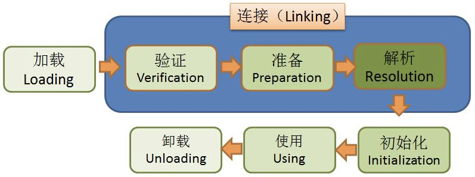
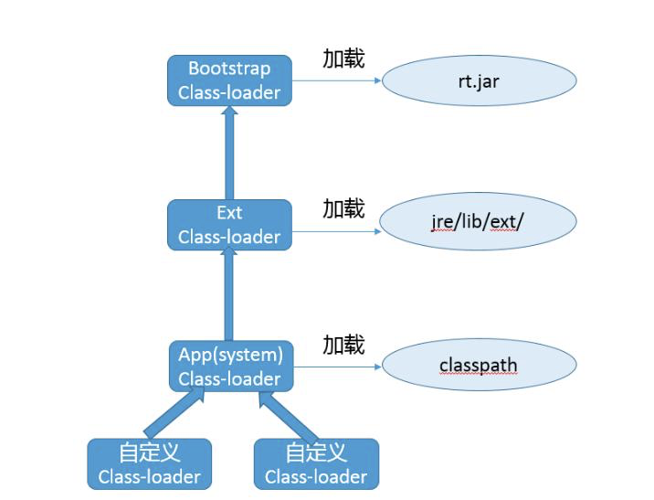

<meta name="referrer" content="no-referrer" />

---
# 一.对象的创建

当Java虚拟机遇到一条字节码new指令的时候，首先将去检查这个指令的参数是否能在常量池中定位到一个类的符号引用，并且检查这个符号引用代表的类是否已被加载、解析和初始化过。如果没有，那必须先执行相应的类加载过程。

<!--More-->
---
# 二.类加载的时机

一个类型从被加载到虚拟机内存中开始，到卸载出内存为止，它的整个生命周期将会经历`加载（loading）`、`验证（Verfication）`、`准备（Preparation）`、`解析（Resolution）`、`初始化（Initialization）`、`使用（Using）`、`卸载（Unloading）`七个阶段，其中*验证、准备、解析三个部分统称为连接（Linking）*。

加载、验证、准备、初始化和卸载这五个阶段的顺序是确定的，类型加载过程必须按照这种顺序按部就班地开始，而解析阶段则不一定：它在某些情况下可以在初始化阶段之后再开始，这是为了支持Java语言的运行时绑定特性（也称为动态绑定或晚期绑定）。这些阶段通常都是互相交叉地混合进行的，会在一个阶段执行的过程中调用、激活另一个阶段。

**对于初始化阶段，有且只有六种情况必须立即对类进行“初始化”（而加载、验证、准备自然需要在此之前开始）：**

1. 遇到new、getstatic、putstatic或invokestatic这四条字节码指令时，如果类型没有进行过初始化，则需要先触发其初始化阶段。能够生成这四条指令的典型Java代码有：
    - 使用new关键字实例化对象的时候
    - 读取或设置一个类型的静态字段（被final修饰、已在编译期把结果放入常量池的静态字段除外）的时候
    - 调用一个类型的静态方法的时候
2. 使用java.lang.reflect包的方法对类型进行反射调用的时候，如果类型没有进行过初始化，则需要先触发其初始化

3. 当初始化类的时候，如果发现其父类还没有进行过初始化，则需要先触发其父类的初始化

4. 当虚拟机启动时，用户需要制定一个要执行的主类（包含main()方法的那个类），虚拟机会先初始化这个主类

5. 当使用JDK7新加入的动态语言支持时，如果一个java.lang.invoke.MethodHandle实例最后的解析结果为REF_getStatic、REF_putStatic、REF_invokeStatic、REF_newInvokeSpecial四种类型的方法句柄，并且这个方法句柄对应的类没有进行过初始化，则需要先触发其初始化

6. 当一个接口中定义JDK8新加入的默认方法（被default关键字修饰的接口方法）时，如果有这个接口的实现类发生了初始化，那该接口要在其之前被初始化

对于这六种会触发类型进行初始化的场景，这六种场景的行为称为对一个类型进行**主动引用**。除此之外，所有引用类型的方式都不会触发初始化，被称为**被动引用**。

## 接口与类的区别

接口与类真正有所区别的是前面讲述的六种“有且仅有”需要触发初始化场景中的第三种：
当一个类在初始化时，要求其父类全部都已经初始化过了，但是一个接口在初始化时，并不要求其父接口全部都完成了初始化，只有在真正使用到父接口（如引用接口中定义的常量）的时候才会初始化。

---

# 三.类加载的过程

## 加载

在加载阶段，Java虚拟机需要完成以下三件事情：

1. 通过一个类的全限定名来获取定义此类的二进制字节流
2. 将这个字节流所代表的静态存储结构转化为方法区的运行时数据结构
3. 在内存中生成一个代表这个类的java.lang.Class对象，作为方法区这个类的各种数据的访问入口

对于数组类而言，情况有所不同，数组类本身不通过类加载器创建，它是由Java虚拟机直接在内存中动态构造出来的。一个数组类（下面简称为C）创建过程中遵循以下规则：

- 如果数组的组件类型（Component Type，指的是数组去掉一个纬度的类型）是引用类型，那就递归采用默认的加载过程去加载这个组件类型，数组C将被标识在加载该组件类型的类加载器的类名称空间上（一个类型必须与类加载器一起确定唯一性）。
- 如果数组的组件类型不是引用类型，Java虚拟机将会把数组C标记为与引导类加载器关联。
- 数组类的可访问性与它的组件类型的可访问性一致，如果组件类型不是引用类型，它的数组类的可访问性将默认为public，可被所有的类和接口访问

加载阶段与连接阶段的部分动作（如一部分字节码文件格式验证动作）是交叉进行的，加载阶段尚未完成，连接阶段可能已经开始，但这些夹在加载阶段之中进行的动作，仍然属于连接阶段的一部分，这两个阶段的开始时间仍然保持着固定的先后顺序。

## 验证

验证是连接阶段的第一步，这一阶段的目的是确保Class文件的字节流中包含的信息符合《Java虚拟机规范》的全部约束要求，保证这些信息被当作代码运行后不会危害虚拟机自身的安全。

验证阶段主要包括：

- 文件格式验证，验证字节流是否符合Class文件格式的规范，并且能被当前版本的虚拟机处理
- 元数据验证，对字节码描述的信息进行语义分析
- 字节码验证，通过数据流分析和控制流分析，确定程序语义是合法的、符合逻辑的。
- 符号引用验证，最后一个阶段的校验行为发生在虚拟机将符号引用转化为直接引用的时候，这个转化动作将在**解析**阶段中发生。

> 在生产环境的实施阶段可以考虑使用-Xverify:none参数来关闭大部分的类验证措施，以缩短虚拟机类加载的时间

## 准备

准备阶段是正式为类中定义的变量（即静态变量，被static修饰的变量）分配内存并设置类变量初始值的阶段。

- 这个阶段仅对类变量，不包括实例变量，实例变量将会在对象实例化时随着对象一起分配在Java堆中。
- 初始值都是各种基础数据类型的默认值，而非程序员声明时的赋值。

## 解析

解析阶段是Java虚拟机将常量池内的符号引用替换为直接引用的过程

- 类或接口的解析
- 字段解析
- 方法解析

## 初始化

类的初始化阶段是类加载过程的最后一个步骤。

在准备阶段时，变量已经赋过一次系统要求的初始零值，而在初始化阶段，则会根据程序员通过程序编码制定的主观计划去初始化类变量和其他资源。

---
# 4.类加载器

## 类与类加载器

类加载器虽然只用于实现类的加载动作，但是它在Java程序中起到的作用却远超类加载阶段。对于任意一个类，都必须由加载它的类加载器和这个类本身一起共同确立其在Java虚拟机中的唯一性，每一个类加载器，都有一个唯一独立的类名称空间。比较两个类是否“相等”，只有在这两个类是由同一个类加载器加载的前提下才有意义，否则，即使这两个类来源于同一个Class文件，被同一个Java虚拟机加载，只要加载它们的类加载器不同，那么这两个类就必不相等。

## 双亲委派模型

站在Java虚拟机的角度来看，只存在两种不同的类加载器：

1. 启动类加载器（Bootstrap ClassLoader），这个类加载器使用C++语言实现，是虚拟机自身的一部分
2. 其他所有的类加载器，这些类加载器都由Java语言实现，独立存在于虚拟机外部，并且全部继承于抽象类java.lang.ClassLoader

绝大多数的Java程序都会使用以下三个系统提供的类加载器来进行加载：

1. 启动类加载器（Bootstrap ClassLoader）：这个类加载器负责加载存放在<JAVA_HOME>/lib目录，或者被-Xbootclasspath参数所指定的路径中存放的，而且是Java虚拟机能够识别的（按照文件名识别，如rt.jar、tools.jar，名字不符合的类库即使放在lib目录中也不会被加载）类库加载到虚拟机的内存中。启动类加载器无法被Java程序直接引用，用户在编写自定义类加载器时，如果需要把加载请求委派给引导类加载器去处理，那直接使用null替代即可。
2. 扩展类加载器（Extension Class Loader）:这个类加载器是在类sun.misc.Launcher$ExtClassLoader中以Java代码的形式实现的。它负责加载<JAVA_HOME>/lib/ext目录中，或者被java.ext.dirs系统变量所指定的路径中所有的类库。这是一种Java系统类库的扩展机制。
3. 应用程序类加载器（Application Class Loader）：这个类加载器由sun.misc.Launcher$AppClassLoader来实现。由于应用程序类加载器是ClassLoader类中的getSystemClassLoader()方法的返回值，所以有些场合中也称它为“系统类加载器”。它负责加载用户类路径（ClassPath）上所有的类库，开发者同样可以直接在代码中使用这个类加载器。

双亲委派模型要求除了顶层的启动类加载器外，其余的类加载器都应该有自己的父类加载器。不过这里类加载器之间的父子关系一般不是以继承的关系来实现的，而是通常使用组合关系来复用父加载器的代码。

### 双亲委派模型的工作过程

如果一个类加载器收到了类加载器的请求，它首先不会自己去尝试加载这个类，而是把这个请求委派给父类加载器去完成，每一个层次的类加载器都是如此，因此所有的加载请求最终都应该传送到最顶层的启动类加载器中，只有当父类加载器反馈自己无法完成这个加载请求时，子加载器才会尝试自己去完成加载。

精确到代码：

> 先检查请求加载的类型是否已被加载过，若没有则调用父加载器的loadClass()当法，若父加载器为空则默认使用启动类加载器作为父加载器。假如父加载器加载失败，抛出ClassNotFoundException异常的话，才调用自己的findClass()方法尝试进行加载。

### 双亲委派模型的好处

一个显而易见的好处就是Java中的类随着它的类加载器一起具备了一种带有优先级的层次关系。例如类Object，被存放在rt.jar中，无论哪一个类加载器要加载这个类，最终都是委派给处于模型最顶端的启动类加载器进行加载，因此Object类在程序的各种类加载器环境中都能够保证是同一个类。

双亲委派模型对于保证Java程序的稳定运作极为重要。