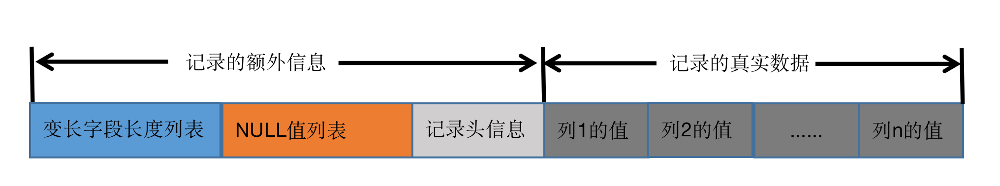

<meta name="referrer" content="no-referrer" />

### InnoDB页简介

InnoDB是一个将表中的数据存储到磁盘上的存储引擎。它将数据划分为若干个页，以页作为磁盘和内存之间交互的基本单位。InnoDB中页的大小一般为16KB。也就是说在一般情况下，一次至少从磁盘中读取16KB的内容到内存中，一次至少把内存中的16KB的内容刷新到磁盘中。

> 系统变量`innodb_page_size`表明了InnoDB存储引擎中的页大小，默认为16384（单位是字节，也就是16KB）。这个变量只能在第一次初始化的Mysql数据目录时指定，之后就再也不能更改了。

<!--More-->
### InnoDB行格式

我们平时都是以记录为单位向表中插入数据的，这些记录在磁盘上的存放形式也被成为行格式或者记录格式。

大体上目前有4种行格式：
- compact
- redundant
- dynamic
- compressed

在创建表或修改表结构时指定行格式的语法：
```
CREATE 表名(列的信息......) ROW_FORMAT=行格式名称;
ALTER TABLE 表名 ROW_FORMAT=行格式名称;
```

#### compact行格式


##### 1.记录的额外信息

这部分信息是服务器为了更高地管理记录而不得不额外添加的一些信息，这些额外信息分为三个部分，分别是变长字段长度列表、NULL值和记录头信息

（1）变长字段长度列表（被定义为VARCHAR(M)、各种TEXT类型、各种BLOB类型）

变长字段占用的存储空间分为两部分:
- 真正的数据内容
- 该数据占用的字节数

变长字段长度的数据特点：
- 各变长字段的真实数据占用的字节数按照列的顺序逆序存放
- 如果该变长字段允许存储的最大字节数（varchar(M)中的M*SHOW CHARSET结果中的Maxlen列[每个字符集都不相同]W的值）超过255个字节，并且真实数据占用的字节数（L）超过127字节，则使用2字节来表示真实数据占用的字节数，否则使用1字节
- 变长字段长度列表中只存储值为非NULL的列的长度，不存放值为NULL的内容长度
- 如果表中所有的列都不是变长的数据类型或者所有列的值都是NULL的话，就不需要有变长字段长度列表

（2）NULL值列表

compact行格式把一条记录中值为NULL的列统一管理起来，存储到NULL值列表中。处理的流程如下：
- 首先统计表中允许存储NULL的列有哪些
- 如果表中没有允许存储NULL的列，则NULL值列表就不存在，否则将每个允许存储NULL的列对应一个二进制位，二进制位按照列的顺序逆序排列（二进制位的值为1时，代表该列的值为NULL；为0时不为NULL）
- Mysql规定NULL值列表必须用整数个字节的位表示，如果使用的二进制位个数不是整数个字节，则在字节的高位补0

（3）记录头信息

记录头信息由固定的5个字节组成（40个二进制位）

|名称|大小（位）|描述|
|:---:|:---:|:---|
|预留位1|1|没有使用|
|预留位2|1|没有使用|
|delete_flag|1|标记该记录是否被删除|
|min_rec_flag|1|B+树的每层非叶子节点中最小的目录项记录都会添加该标记|
|n_owned|4|一个页面中的记录会被分成若干个组，每个组中有一个记录是“带头大哥”，记录的n_owned值代表组中所有的记录条数。其余的都是小弟，记录的为0|
|heap_no|13|表示当前记录在页面堆中的相对位置|
|record_type|3|表示当前记录的类型：0-普通记录；1-B+树非叶子节点的目录项记录；2-Infimum记录；3-Supremum记录|
|next_record|16|表示下一条记录的相对位置|

##### 2.记录的真实数据

对于我们定义的数据列来说，对于每个记录mysql都会默认地添加一些隐藏列：

|列名|是否必需|占用空间|描述|
|:---:|:---:|:---:|:---:|
|row_id|否|6个字节|行ID，唯一标识一条记录|
|trx_id|是|6个字节|事务ID|
|roll_pointer|是|7个字节|回滚指针|

**InnoDB的主键生成策略**
优先使用用户自定义的主键作为主键；如果用户没有定义主键，则选取一个不允许为null值的UNIQUE键作为主键；以上两种条件都没有，则会默认添加一个名为row_id的隐藏列作为主键

**隐藏列和真实数据的排列**

- 在实际存储中，隐藏列会按照row_id、trx_id、roll_pointer的顺序排列在最前面
- 紧接着就会按照创建表的字段顺序依次排列在三个隐藏列的后面（NULL值不会冗余存储）

##### 3.CHAR(M)列的存储格式

在mysql中有如下字符集：
- ascii采用固定的一个字节来编码一个字符，是一个定长的编码字符集
- gbk表示一个字符需要1~2个字节
- utf8表示一个字符需要1~3个字节

对于CHAR(M)类型的列来讲：
- 采用定长的编码字符集，该列占用的字节数不会被加到变长字段长度列表中
- 采用变长的编码字符集，该列占用的字节数会被加到变长字段长度列表中

> 另外当采用变长的字符集编码格式的时候对于CHAR(M)还规定：CHAR(M)至少要求占用M个字节。比如utf8格式的话，定义CHAR(10)，长度就是10~30字节，即使存储空字符串也会占用十个字节。这主要是希望未来在更新该列时，在新值的字节长度大于旧值的字节长度但不大于10个字节时，可以在该记录处直接更新而不用重新分配空间

#### redundant行格式

在5.0之前在使用的一种格式，很古老,比较原始的行格式，是非紧凑的，比其他三种占用的存储空间多

### 溢出列

在compact和redundant行格式中，对于占用存储空间非常多的列，在记录的真实数据处只会存储该列的一部分数据，而把剩余的数据分散存储到其他的页中，然后在记录的真实数据处用20字节存储指向这些页的地址，从而可以找到剩余数据所在的页（剩余数据的多个页面使用链表连接起来）

如果一条记录的某个列中存储的数据占用的字节数非常多时，该列就可能成为溢出列

### dynamic行格式和compressed行格式

5.7默认的行格式是`dynamic`

共同点：
- 他们都是继承于compact行格式
- 在处理溢出页的时候不会在记录的真实数据处存储该溢出列的真实数据的前n个字节的数据，而是将该列的所有真实数据都存储到溢出页中，只在记录的真实数据处存储20个字节大小的指向溢出页的地址（当然，这20字节还包括真实数据占用的字节数）

不同点：
- compressed行格式会采用压缩算法对页面进行压缩，以节省空间。


