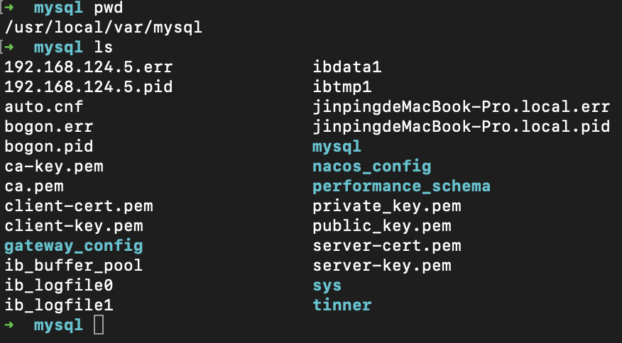
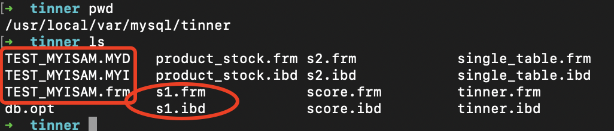

<meta name="referrer" content="no-referrer" />

### 数据库和文件系统的关系

像InnoDB、MyISAM这样的存储引擎都是把数据存储在文件系统中上。当我们想读取数据的时候，这些存储引擎会从文件系统中把数据读出来返回给我们；当我们想写入数据的时候，这些存储引擎会把这些数据又写回操作系统。

<!--More-->

### Mysql数据目录

Mysql服务器程序在启动时，会到文件系统的某个目录下加载一些数据，之后在运行过程中产生的数据也会存储到这个目录下的某些文件中。这个目录就称为数据目录。

##### 确定Mysql中的数据目录
运行如下命令：
```
mysql> SHOW VARIABLES LIKE 'datadir';
+---------------+-----------------------+
| Variable_name | Value                 |
+---------------+-----------------------+
| datadir       | /usr/local/var/mysql/ |
+---------------+-----------------------+
1 row in set (0.00 sec)
```
即可看到数据目录在我们计算机中的位置

##### 创建数据库的时候都发生了什么
在我们使用“CREATE DATABASE 数据库名”语句创建一个数据库的时候，会在文件系统中发生：
- 在数据目录下创建一个与数据库名同名的子目录（或者说是文件夹）
- 在与该数据库名同名的子目录下创建一个名为db.opt的文件。这个文件中包含了该数据库的一些属性，比如该数据库的字符集和比较规则

##### 数据库的文件表示
我先来查看我当前拥有的数据库
```
mysql> SHOW DATABASES;
+--------------------+
| Database           |
+--------------------+
| information_schema |
| gateway_config     |
| mysql              |
| nacos_config       |
| performance_schema |
| sys                |
| tinner             |
+--------------------+
7 rows in set (0.00 sec)
```
可以看到，当前在我的计算机上有7个数据库，其中gateway_config、nacos_config和tinner是我自定义的，其余4个数据库都是Mysql自带的系统数据库

再来看看我的目录结构

自己看会发现，除了information_schema这个系统数据库外，其他数据库在数据目录下都有对应的子目录

##### 表在文件系统中的表示

我们的数据其实都是以记录的形式插入到表中的。每个表的信息可以分为两种：
- 表结构的定义
- 表中的数据

MyISAM和InooDB都在数据目录下对应的数据库子目录创建了一个专门用于描述`表结构`的文件，文件名是`表名.frm`，以二进制格式存储。

而在数据存入文件上MyISAM和InooDB产生了分歧：

###### <1>InnoDB：

- InnoDB使用页为基本单位来管理存储空间的，默认的页大小为16KB
- 对于InnoDB存储引擎来说，每个索引都对应着一棵B+树，该树的每个节点都是一个数据页。数据页之间没有必要是物理连续的，因为数据页之间有双向链表来维护这些页的顺序
- InnoDB的聚簇索引的叶子节点存储了完整的用户记录，也就是“索引即数据，数据即索引”

**1.系统表空间**

在默认情况下，InnoDB会在数据目录下创建爱你一个名为ibdata1、大小为12MB的文件，这个文件就是对应的系统表空间在文件系统上的表示。这个文件是自扩展文件，当不够用的时候它会自己增加文件大小

在一个Mysql服务器中，系统表空间只有一份。从Mysql5.5.7到Mysql5.6.5之间的各个版本中，表中的数据都会被默认存储到这个系统表空间。

**2.独立表空间**

在Mysql5.6.6以及之后的版本中，InnoDB会为每个表建立一个独立表空间。在存储表数据时，会在该表所属数据库对应的子目录下创建一个表示该独立表空间的文件，该文件为`表名.ibd`。

假如我在tinner库下创建了s1表，那么在对应的tinner目录下回生成两个文件：
- s1.frm
- s1.ibd

其中ibd文件用来存储表中的数据

当我们想刻意将表数据都存储到系统表空间时，在配置文件中修改：
```
[server]
innodb_file_per_table:0
```
当innodb_file_per_table为0时，代表使用系统表空间，为1时使用独立表空间。不过只对新增的表有效

将已经存储到系统表空间中的表转移到独立表空间：
```
ALTER TABLE 表名 TABLESPACE innodb_file_per_table;
```

将已经存储到独立表空间的表转移到系统表空间:
```
ALTER TABLE 表名 TABLESPACE innodb_system;
```

**3其他类型的表空间**
通用表空间、undo表空间、临时表空间等

###### <2>MyISAM：

MyISAM中的索引相当于全部都是二级索引，该存储引擎的数据和索引是分开存放的。没有表空间一说。在创建爱你表之后会创建如下三个文件：
- 表名.frm
- 表名.MYD
- 表名.MYI


其中，表名.MYD表示表的数据文件，表名MYI表示表的索引文件。

##### 其他文件

除了上面说的这些童虎自己存储的数据以外，数据目录下还包含了一些确保程序更好运行的额外文件，主要包括：
- 服务器进程文件：每运行一个mysql服务器程序，都意味着启动一个进程。mysql服务器会把自己的进程ID写到这个文件中
- 服务器日志文件
- ssl和rsa证书与秘钥文件：主要是为了客户端和服务器安全通信而创建的一些文件

### 文件系统对数据库的影响

- 数据库名称和表名不得超过文件系统所允许的最大长度
- 特殊字符的问题：比如创建‘test?’表，则生成了'test@003f.frm'文件
- 文件长度受文件系统最大长度限制

### Mysql系统数据库简介

在前文看到除了我自定义的3个数据库，还有4个数据库，属于系统自带的数据库
- mysql：存储了Mysql的用户账户和权限信息、一些存储过程和事件的定义信息、一些运行过程中产生的日志信息、一些帮助信息以及时区信息等
- information_schema：存放元数据信息，保存着服务器维护的所有其他数据库的信息（表、视图、触发器、列、索引等）
- performance_schema：存放运行过程中的状态信息，算是对Mysql服务器的一个性能监控
- sys：通过视图的形式将information_schema和performance_schema结合起来


