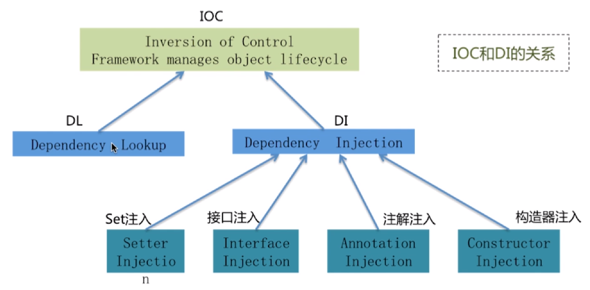
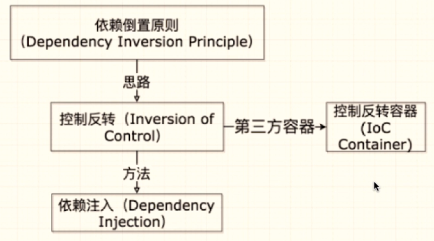
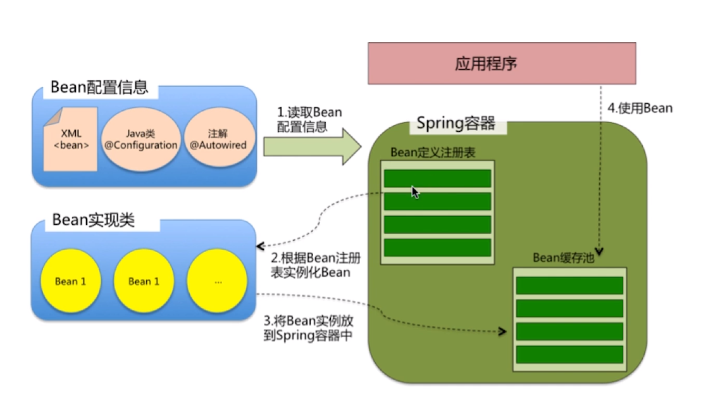
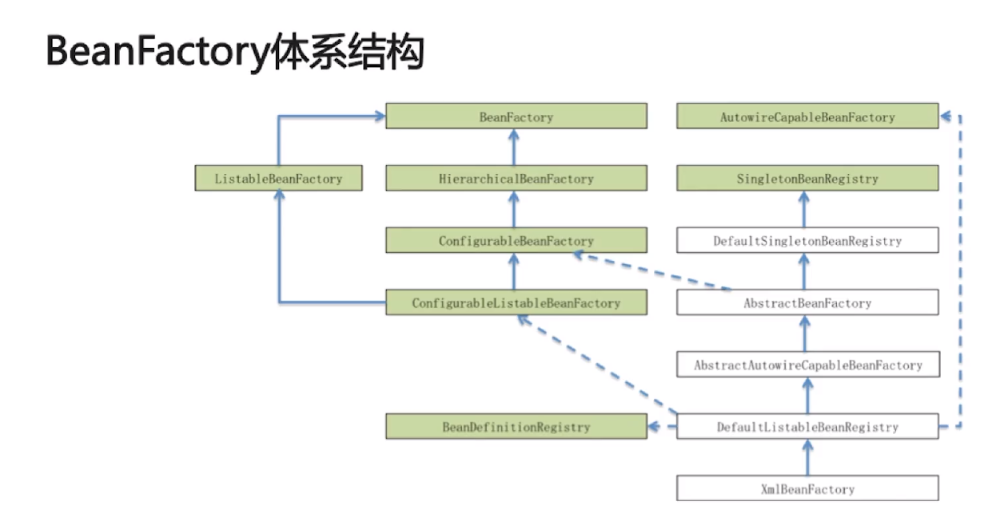
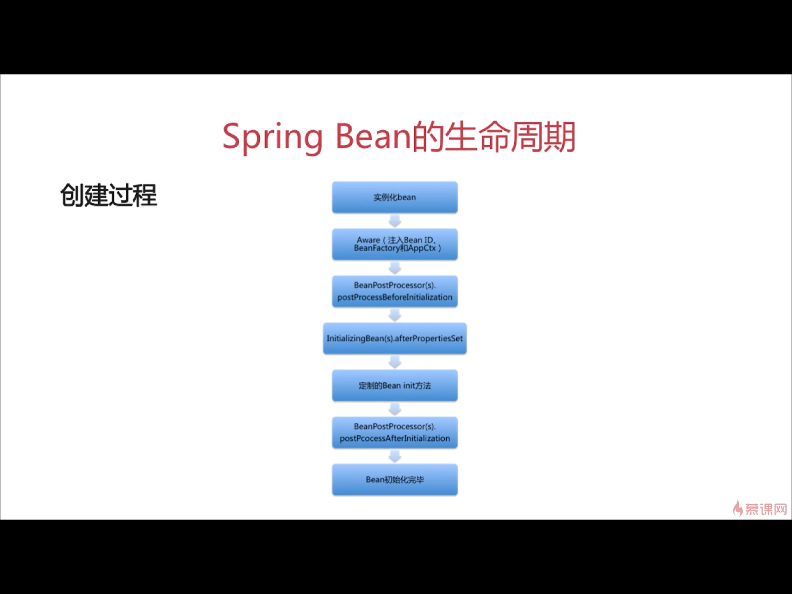
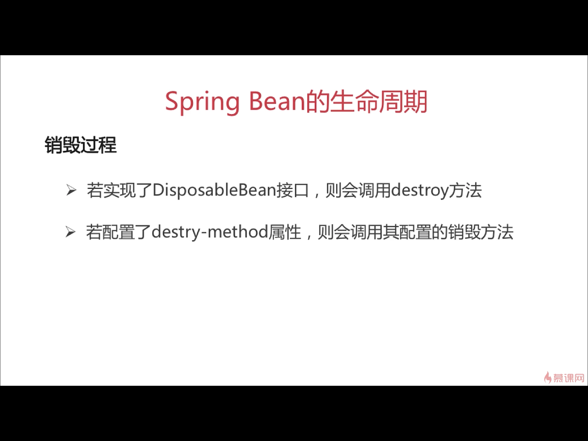

<meta name="referrer" content="no-referrer" />

<!-- more -->
## 一、Spring发展的几个大致阶段

SpringCore最初应用的是工厂模式（DI）和代理模式（AOP），用来解耦应用组件；SpringMVC用来解决web应用的开发；又发现每次开发都需要写很多配置样板代码，为了更方便地整合引入了SpringBoot一些列stater；SringCloud的意义在于推动了微服务架构的落地。

## 二、IOC(Inversion of Control):控制反转

不是一种技术，而是一种思想，是SpringCore最核心的部分

- IOC的优势
    1.避免在各处使用new来创建类，并且可以做到统一维护
	2.创建实例的时候不需要了解其中的细节
- IOC支持的功能
	**依赖注入**
    依赖检查
	**自动装配**
    支持集合
    指定初始化方法和销毁方法
    支持回调方法（有侵入方式，需谨慎使用）

### 1. IOC的实现方式

- 依赖注入（Dependency Injection），是当前IOC的主流实现
    Setter方法注入
	接口注入
	注解注入
	构造器注入

- 依赖查找（Dependency Lookup）
	DL相对于DI而言是一种更为主动的方法，他会在需要的时候通过调用框架来获取对象，获取时需要提供配置文件相关的路径、key等信息来确定获取对象的状态。DL需要用户自己去使用API进行查找资源和组装对象，对业务有侵入性，已经被抛弃。

### 2. 依赖倒置原则：

- 是一种思想，高层模块不应该依赖于底层模块，两者都应该依赖于其抽象		
- 由于依赖倒置原则思想，才有了IOC的思路，而DI是实现IOC的方法

		
### 3.容器（控制反转容器）

Spring框架基于IOC提出了容器的概念。容器管理着bean的生命周期，控制着bean的依赖注入。
		
Spring启动时去读取应用程序提供的bean配置信息，并在Spring容器中生成一份响应的bean配置注册表，然后根据这张注册表去实例化bean，装配好bean之间的依赖关系，为上层提供准备就绪的运行环境。Spring提供一个配置文件描述bean还有bean之间的依赖关系，利用java语言的反射功能实例化bean并建立bean之间的依赖关系。

**在Spring容器中，默认的情况下bean都是以单例的形式存在的**
	
#### 3.1 SpringIOC容器的核心接口

	
- BeanFactory
    最核心的接口
    提供了IOC的配置机制
    包含了bean的各种定义，便于实例化Bean
    在对象实例化之时建立bean之间的依赖关系
    包含了bean生命周期的控制

- ApplicationContext
    BeanFactory的子接口之一，能够管理、装配bean
    继承了ResourcePatternResolver接口，能够加载资源文件
    继承了MessageSource接口，能够实现国际化能功能
    继承了ApplicationEventPublisher接口，能够注册监听器，实现监听机制

- 两者比较
    BeanFactory是Spring框架的基础设施，面向Spring
    ApplicationContext面向使用Spring框架的开发者

#### 3.2 几个重要的类和方法

- BeanDefinition
    主要用来描述bean的定义，Spring容器在启动的时候会将xml或者注解中的bean的定义解析成Spring内部的BeanDefinition

- BeanDefinitionRegistry
    提供了向IOC容器注册BeanDefinition对象的方法。
    Spring将bean的定义解析成BeanDefinition之后会通过BeanDefinitionRegistry以beanName为key，BeanDefinition为value存储到BeanDefinitionMap(ConcurrentHashmap)中，同时还将beanName存储到beanDefinitionNames的ArrayList中去，以便后续bean的实例化。

- refresh方法
    主要为IOC容器以及Bean的生命周期管理提供条件
    用于刷新Spring整个上下文信息，定义Spring上下文加载流程

- getBean方法
    getBean用来加载bean，主要用于查找或实例化bean
    实现主要是通过AbstractBeanFactory方法去实现的，所有的getBean方法最终都会去调用doGetBean方法
    大致逻辑：
    >首先会通过调用transformedBeanName转换beanName
    之后会尝试从缓存中加载实例，或者从工厂中返回实例
    实例化bean
    检测parentBeanFactory
    初始化依赖的bean
    创建bean
    在检查bean的类型符合要求之后进行返回

### 3.3 Spring Bean的作用域（5个）

- singleton：Spring的默认作用域，容器里拥有唯一的bean实例
- prototype：针对每个getBean请求，容器都会创建一个bean实例
- request：会为每个http请求创建一个单独的bean实例
- session：会为每个session创建一个bean实例
- globalSession：会为每个全局的HttpSession创建一个bean实例，该作用域仅对Portlet有效

### 3.4 Springbean的生命周期

- 创建过程

- 销毁过程

## 三、 AOP面向切面编程

### 1.产生的背景

软件工程有一个基本编码原则：关注点分离（不同的问题交给不同的部分去解决，每部分专注于解决自己的问题）。AOP正是此种技术的实现，我们的代码主要就是实现某种特定的功能实现逻辑，但是我们往往不能专注于业务逻辑。比如我们写业务逻辑代码的同时还要写事务管理、缓存、日志等通用化的功能，而且这些通用化的功能还要与业务功能混写在一起，就很痛苦。为了将业务功能的专注点和通用功能的专注点分离开来，就出现了AOP的技术，这些通用化功能的代码实现，对应的就是所谓的切面（Aspect）。业务功能代码合切面代码分开之后，架构将变得高内聚低耦合。为了确保功能的完整性，切面最终需要被合并到业务中（织入Weave）。而对于业务代码，我需要在那些地方加入这些通用功能的代码，就是切点。

### 2.织入的三种方式
			
- 编译时织入：在代码编译时，把切面代码融合进来，生成完整功能的Java字节码，需要特殊的Java编辑器，如AspectJ
- 类加载时织入：在字节码加载的时候，把切面的代码融合进来，需要特殊的Java编辑器，如AspectJ和AspectWorkz
- 运行时织入：Spring采用的方式，通过动态代理的方式，调用切面代码增强业务功能，实现简单

### 3.主要名词概念

- **Aspect：** 通用功能的代码实现
- **Target：** 被织入Aspect的对象
- **JoinPoint：** 可以作为切入点的机会，所有方法都都可以作为切入点
- **Pointcut：** Aspect实际被应用在的Join Point，支持正则
- **Advice(通知)：** 类里的方法以及这个方法如何织入到目标方法的方式
- **Weaving(织入):** AOP的实现过程。即将切面应用到实际对象，从而创建一个新的代理对象的过程。对于Spring来说，就是初始化context中的对象时，完成织入操作。

### 4.Advice的类型（通知的5种类型）

- 前置通知（Before）
- 后置通知（AfterReturning）
- 异常通知（AfterThrowing）
- 最终通知（After）
- 环绕通知（Around）

### 5.Spring提供了两种方式来生成代理对象

- JdkProxy
    核心：通过Java的内部反射机制来接收被代理的类，并且要求被代理的类必需实现InvocationHandler接口
    核心就是和InvocationHandler接口和Proxy类
    反射机制在生成类的过程中比较高效
- cglib
    以继承的方式动态地生成目标类的代理，它是通过修改字节码来实现代理的。（如果某个类是final修饰的，则不能用此种方式）
    借助ASM实现（ASM是一种可以操作字节码的框架）
    ASM在生成类之后的执行过程中比较高效

具体使用哪种方式生成由AopProxyFactory根据AdvisedSupport对象的配置来决定

默认的策略：*如果目标类是接口，则用JdkProxy来实现，否则用后者*

## 四、代理模式：接口+真实实现类+代理类

- 其中，真实实现类和代理类都是需要实现接口的，实例化的时候要使用代理类。
- SpringAOP需要做的是生成一个代理类来替换掉真实实现类以对外提供服务
- Spring里的代理模式的实现
    对Spring来讲，真实实现类的逻辑包含在了getBean方法里面
    getBean方法返回的实际上是Proxy的实例
    Proxy实例是Spring采用Jdk proxy或CGLIB动态生成的

## 五、Spring事务的相关考点

ACID
隔离级别
事务传播

