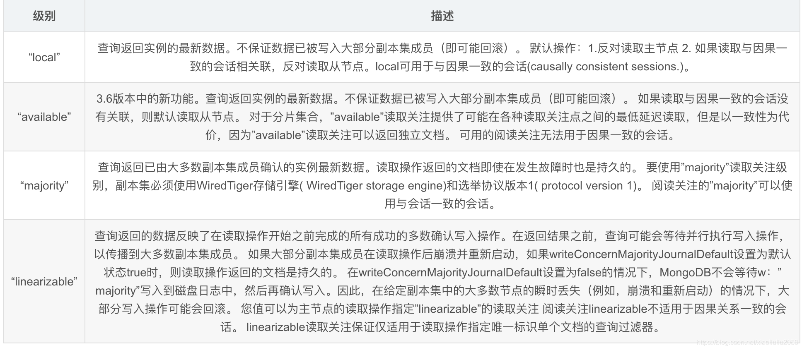
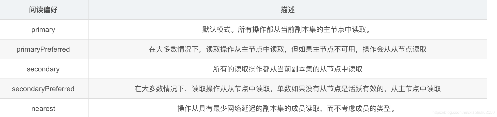

<meta name="referrer" content="no-referrer" />

## 前言

本文以MongoDB 4.0版本为准，介绍服务器端、客户端的关键技术，以及使用中的注意事项。

## 服务器（Server）

### 部署方式

#### 1.单机部署方式

适用场景:开发、测试

<!-- more -->

#### 2.副本集部署方式

适用场景：数据的高可用性， 保证数据的安全性，可恢复性

特性：
- N个节点的集群
- 任何节点都可以作为主节点
- 所有写入操作都在主节点上
- 自动故障转移
- 自动恢复

**原理：**

主节点记录在其上的所有操作`oplog`，从节点定期轮询主节点获取这些操作，然后对自己的数据副本执行这些操作，从而保证从节点的数据与主节点一致。

#### 3.分片集部署方式

适用场景：高增长的大量数据

特性：
- 包含副本集的特点
- 支持数据分片存储
- 一般来说每个shard都有自己的副本集

|名称|解释|作用|
|:---:|:---:|:---|
|Shard|分片集存储实例|用于存储实际的数据块，实际生产环境中一个`shard server`角色可由几台机器组个一个`replica set`承担，防止单机节点故障|
|config server|分片集配置器|存储了整个ClusterMetadata，其中包括 chunk信息|
|mongos|分片集路由器|客户端由此接入，且让整个集群看上去像单一数据库，前端应用可以透明使用|

### 存储引擎

#### MMAP(3.0后有一个改进版本MMAPv1)

早期的mongoDB存储引擎，存在一些问题:
- 锁粒度为库级别锁
- 耗费过多的磁盘空间
- 内存无限制，有多少用多少
- 集合和索引都混合存储在数据库文件中，即使删掉了某个集合或者索引，占用的磁盘空间也很难及时自动回收
- 文档按照写入顺序排列存储。如果文档更新后长度变长且原有存储位置后面没有足够的空间放下增长部分的数据，那么文档就要移动到文件中的其他位置。这种因更新导致的文档位置移动会严重降低写性能，因为一旦文档发生移动，集合中的所有索引都要同步修改文档新的存储位置

#### WiredTiger

目前默认的存储引擎，有以下的特点：
- 通过MVCC实现文档级别的并发控制，即文档级别锁。这在提升数据库读写性能的同时，大大提高了系统的并发处理能力。
- 支持对所有集合和索引进行Block压缩和前缀压缩（如果数据库启用了journal，journal文件一样会压缩）。
- 集合和索引分开文件存储
- 支持内存使用容量配置

#### RocksDB

插件式引擎引入的第三方引擎:
- K/V式的存储引擎
- 用自己的方式实现了大部分引擎的功能
- 集合的数据删除后，存储空间并不是立即回收，RocksDB 要通过后台压缩来逐步回收空间
- mongorcks 对 oplog 空间的删除机制是在用户请求路径里进行的，这样可能导致写入的延迟上升，应像 wiredtiger 这样当 oplog 空间超出时，后台线程来回收。
- RocksDB 缺乏批量日志提交的机制，无法将多次并发的写log进行合并，来提升效率。

### 索引

支持普通索引、唯一索引、全文索引。

## 客户端（client）

### 写策略（WriteConcern选项）

MongoDB支持的WriteConcern选项如下：
- w: 数据写入到number个节点才向用客户端确认
- {w: 0} 对客户端的写入不需要发送任何确认，适用于性能要求高，但不关注正确性的场景
- {w: 1} 默认的writeConcern，数据写入到Primary就向客户端发送确认
- {w: “majority”} 数据写入到副本集大多数成员后向客户端发送确认，适用于对数据安全性要求比较高的场景，该选项会降低写入性能
- {w:-1} 忽略网络错误
- {w:2} 要求以写入到副本集的主服务器和一个备用服务器
- j: 写入操作的journal持久化后才向客户端确认
- 默认为：{j: false}，如果要求Primary写入持久化了才向客户端确认，则指定该选项为true

`wtimeout`: 写入超时时间，仅w的值大于1时有效。
- 当指定{w: }时，数据需要成功写入number个节点才算成功，如果写入过程中有节点故障，可能导致这个条件一直不能满足，从而一直不能向客户端发送确认结果，针对这种情况，客户端可设置`wtimeout`选项来指定超时时间，当写入过程持续超过该时间仍未结束，则认为写入失败。

**{w: “majority”}解析**
{w: 1}、{j: true}等writeConcern选项很好理解，Primary等待条件满足发送确认；但{w: “majority”}则相对复杂些，需要确认数据成功写入到大多数节点才算成功，而MongoDB的复制是通过Secondary不断拉取oplog并重放来实现的，并不是Primary主动将写入同步给Secondary。

**那么Primary是如何确认数据已成功写入到大多数节点的？**
- Client向Primary发起请求，指定writeConcern为{w: “majority”}，Primary收到请求，本地写入并记录写请求到oplog，然后等待大多数节点都同步了这条/批oplog（Secondary应用完oplog会向主报告最新进度)。
- Secondary拉取到Primary上新写入的oplog，本地重放并记录oplog。为了让Secondary能在第一时间内拉取到主上的oplog，find命令支持一个awaitData的选项，当find没有任何符合条件的文档时，并不立即返回，而是等待最多maxTimeMS(默认为2s)时间看是否有新的符合条件的数据，如果有就返回；所以当新写入oplog时，备立马能获取到新的oplog。
- Secondary上有单独的线程，当oplog的最新时间戳发生更新时，就会向Primary发送replSetUpdatePosition命令更新自己的oplog时间戳。
- 当Primary发现有足够多的节点oplog时间戳已经满足条件了，向客户端发送确认。
 
#### writeConcern总结
 
1、write concern用于控制写入安全的级别，可以分为应答式写入以及非应答式写入
2、write concern是一个性能和数据强一致性的权衡，应根据业务场景进行设定
3、对于强一致性场景，建议w>1或者等于majority，以及journal为true，否则w=0
4、在副本集的情形下，建议通过配置文件来修改w以及设置wtimeout，以避免由于某个节点挂起导致无法应答

#### writeConcern 和getLastError 的关系

mongodb有一个`write concern`的设置，作用是保障`write operation`的可靠性。一般是在client driver里设置的，和db.getLastError()方法关系很大
一般来说，所有的mongo driver，在执行一个写操作（insert、update、delete）之后，都会立刻调用db.getLastError()方法。这样才有机会知道刚才的写操作是否成功，如果捕获到错误，就可以进行相应的处理。处理逻辑也是完全由client决定的，比如写入日志、抛出错误、等待一段时间再次尝试写入等。作为`mongodb server`并不关心，server只负责通知client发生了错误

这里有3点需要注意：    
- db.getLastError()方法是由driver负责调用的，所以业务代码不需要去显式调用。这点后面还会专门提到。
- driver一定会调用db.getLastError()函数，但是并不一定能捕获到错误。这主要取决于write concern的设置级别。
- 写安全机制 实际上就是在 安全性跟性能之间做权衡。

### 读策略(ReadConcern和ReadPreference)

#### ReadConcern级别以及作用

#### ReadPreference设置参数

