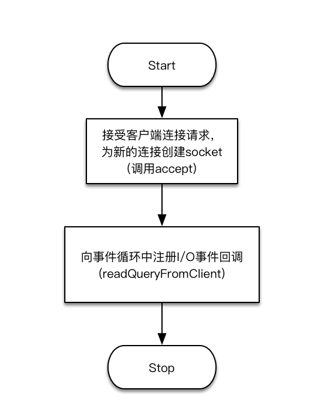
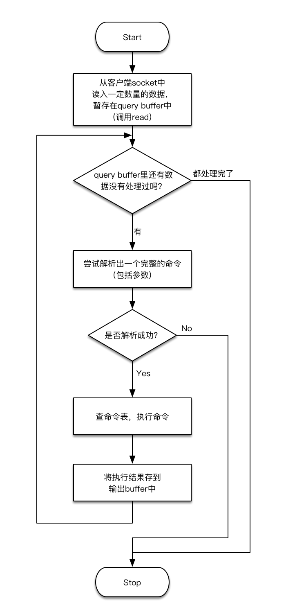

<meta name="referrer" content="no-referrer" />

Redis是用C语言实现的，首先，你当然应该从main函数开始读起。但我们在读的时候应该抓住一条主线，也就是当我们向Redis输入一条命令的时候，代码是如何一步步执行的。这样我们就可以先从外部观察，尝试执行一些命令，在了解了这些命令执行的外部表现之后，再钻进去看对应的源码是如何实现的。要想读懂这些代码，首先我们需要理解Redis的事件机制。而且，一旦理解了Redis的事件循环(Event Loop)的机制，我们还会搞明白一个有趣的问题：为什么Redis是单线程执行却能同时处理多个请求？（当然严格来说Redis运行起来并非只有一个线程，但除了主线程之外，Redis的其它线程只是起辅助作用，它们是一些在后台运行做异步耗时任务的线程）

从main函数开始，沿着代码执行路径，实际上我们可以一直追下去。

本文按照如下思路进行：
- 先概括地介绍整个代码初始化流程（从main函数开始）和事件循环的结构；
- 再概括地介绍对于Redis命令请求的处理流程；
- 重点介绍事件机制；
- 对于前面介绍的各个代码处理流程，给出详细的代码调用关系，方便随时查阅；

注：本文的分析基于Redis源码的5.0分支。
  

### 初始化流程和事件循环概述
Redis源码的main函数在源文件server.c中。main函数开始执行后的逻辑可以分为两个阶段：
- 各种初始化（包括事件循环的初始化）；
- 执行事件循环。

这两个执行阶段可以用下面的流程图来表达：

首先，我们看一下初始化阶段中的各个步骤：
- **配置加载和初始化**。这一步表示Redis服务器基本数据结构和各种参数的初始化。在Redis源码中，Redis服务器是用一个叫做`redisServer`的struct来表达的，里面定义了Redis服务器赖以运行的各种参数，比如监听的端口号和文件描述符、当前连接的各个client端、Redis命令表(command table)配置、持久化相关的各种参数，等等，以及后面马上会讨论的事件循环结构。Redis服务器在运行时就是由一个`redisServer`类型的全局变量来表示的（变量名就叫`server`），这一步的初始化主要就是对于这个全局变量进行初始化。在整个初始化过程中，有一个需要特别关注的函数：`populateCommandTable`。它初始化了Redis命令表，通过它可以由任意一个Redis命令的名字查找该命令的配置信息（比如该命令接收的命令参数个数、执行函数入口等）。在本文的第二部分，我们将会一起来看一看如何从接收一个Redis命令的请求开始，一步步执行到来查阅这个命令表，从而找到该命令的执行入口。另外，这一步中还有一个值得一提的地方：在对全局的`redisServer`结构进行了初始化之后，还需要从配置文件（redis.conf）中加载配置。这个过程可能覆盖掉之前初始化过的`redisServer`结构中的某些参数。换句话说，就是先经过一轮初始化，保证Redis的各个内部数据结构以及参数都有缺省值，然后再从配置文件中加载自定义的配置。
- **创建事件循环**。在Redis中，事件循环是用一个叫`aeEventLoop`的struct来表示的。「创建事件循环」这一步主要就是创建一个`aeEventLoop`结构，并存储到`server`全局变量（即前面提到的`redisServer`类型的结构）中。另外，事件循环的执行依赖系统底层的I/O多路复用机制(I/O multiplexing)，比如Linux系统上的epoll机制[1]。因此，这一步也包含对于底层I/O多路复用机制的初始化（调用系统API）。
- **开始socket监听**。服务器程序需要监听才能收到请求。根据配置，这一步可能会打开两种监听：对于TCP连接的监听和对于Unix domain socket[2]的监听。「Unix domain socket」是一种高效的进程间通信(IPC[3])机制，在POSIX规范[4]中也有明确的定义[5]，用于在同一台主机上的两个不同进程之间进行通信，比使用TCP协议性能更高（因为省去了协议栈的开销）。当使用Redis客户端连接同一台机器上的Redis服务器时，可以选择使用「Unix domain socket」进行连接。但不管是哪一种监听，程序都会获得文件描述符，并存储到`server`全局变量中。对于TCP的监听来说，由于监听的IP地址和端口可以绑定多个，因此获得的用于监听TCP连接的文件描述符也可以包含多个。后面，程序就可以拿这一步获得的文件描述符去注册I/O事件回调了。
- **注册timer事件回调**。Redis作为一个单线程(single-threaded)的程序，它如果想调度一些异步执行的任务，比如周期性地执行过期key的回收动作，除了依赖事件循环机制，没有其它的办法。这一步就是向前面刚刚创建好的事件循环中注册一个timer事件，并配置成可以周期性地执行一个回调函数：`serverCron`。由于Redis只有一个主线程，因此这个函数周期性的执行也是在这个线程内，它由事件循环来驱动（即在合适的时机调用），但不影响同一个线程上其它逻辑的执行（相当于按时间分片了）。`serverCron`函数到底做了什么呢？实际上，它除了周期性地执行过期key的回收动作，还执行了很多其它任务，比如主从重连、Cluster节点间的重连、BGSAVE和AOF rewrite的触发执行，等等。这个不是本文的重点，这里就不展开描述了。
- **注册I/O事件回调**。Redis服务端最主要的工作就是监听I/O事件，从中分析出来自客户端的命令请求，执行命令，然后返回响应结果。对于I/O事件的监听，自然也是依赖事件循环。前面提到过，Redis可以打开两种监听：对于TCP连接的监听和对于Unix domain socket的监听。因此，这里就包含对于这两种I/O事件的回调的注册，两个回调函数分别是`acceptTcpHandler`和`acceptUnixHandler`。对于来自Redis客户端的请求的处理，就会走到这两个函数中去。我们在下一部分就会讨论到这个处理过程。另外，其实Redis在这里还会注册一个I/O事件，用于通过管道(pipe[6])机制与module进行双向通信。这个也不是本文的重点，我们暂时忽略它。
- **初始化后台线程**。Redis会创建一些额外的线程，在后台运行，专门用于处理一些耗时的并且可以被延迟执行的任务（一般是一些清理工作）。在Redis里面这些后台线程被称为bio(Background I/O service)。它们负责的任务包括：可以延迟执行的文件关闭操作(比如unlink命令的执行)，AOF的持久化写库操作(即fsync调用，但注意只有可以被延迟执行的fsync操作才在后台线程执行)，还有一些大key的清除操作(比如flushdb async命令的执行)。可见bio这个名字有点名不副实，它做的事情不一定跟I/O有关。对于这些后台线程，我们可能还会产生一个疑问：前面的初始化过程，已经注册了一个timer事件回调，即`serverCron`函数，按说后台线程执行的这些任务似乎也可以放在`serverCron`中去执行。因为`serverCron`函数也是可以用来执行后台任务的。实际上这样做是不行的。前面我们已经提到过，`serverCron`由事件循环来驱动，执行还是在Redis主线程上，相当于和主线程上执行的其它操作（主要是对于命令请求的执行）按时间进行分片了。这样的话，`serverCron`里面就不能执行过于耗时的操作，否则它就会影响Redis执行命令的响应时间。因此，对于耗时的、并且可以被延迟执行的任务，就只能放到单独的线程中去执行了。
- **启动事件循环**。前面创建好了事件循环的结构，但还没有真正进入循环的逻辑。过了这一步，事件循环就运行起来，驱动前面注册的timer事件回调和I/O事件回调不断执行。

注意：Redis服务器的初始化其实还要完成很多很多事，比如加载数据到内存，Cluster集群的初始化，module的初始化，等等。但为了简化，上面讨论的初始化流程，只列出了我们当前关注的步骤。本文关注的是由事件驱动的整个运行机制以及跟命令执行直接相关的部分，因此我们暂时忽略掉其它不太相关的步骤。

现在，我们继续去讨论上面流程图中的第二个阶段：事件循环。

我们先想一下为什么这里需要一个循环。

一个程序启动后，如果没有循环，那么它从第一条指令一直执行到最后一条指令，然后就只能退出了。而Redis作为一个服务端程序，是要等着客户端不停地发来请求然后做相应的处理，不能自己执行完就退出了。因此，Redis启动后必定要进入一个无限循环。显然，程序在每一次的循环执行中，如果有事件（包括客户端请求的I/O事件）发生，就会去处理这些事件。但如果没有事件发生呢？程序显然也不应该空转，而是应该等待，把整个循环阻塞住。这里的等待，就是上面流程图里的「等待事件发生」这个步骤。那么，当整个循环被阻塞住之后，什么时候再恢复执行呢？自然是等待的事件发生的时候，程序被重新唤醒，循环继续下去。这里需要的等待和唤醒操作，怎么实现呢？它们都需要依赖系统的能力才能做到（我们在文章第三部分会详细介绍）。

实际上，这种事件循环机制，对于开发过手机客户端的同学来说，是非常常见且基础的机制。比如跑在iOS/Android上面的App，这些程序都有一个消息循环，负责等待各种UI事件（点击、滑动等）的发生，然后进行处理。同理，对应到服务端，这个循环的原理可以认为差不多，只是等待和处理的事件变成是I/O事件了。另外，除了I/O事件，整个系统在运行过程中肯定还需要根据时间来调度执行一些任务，比如延迟100毫秒再执行某个操作，或者周期性地每隔1秒执行某个任务，这就需要等待和处理另外一种事件——timer事件。

timer事件和I/O事件是两种截然不同的事件，如何由事件循环来统一调度呢？假设事件循环在空闲的时候去等待I/O事件的发生，那么有可能一个timer事件先发生了，这时事件循环就没有被及时唤醒（仍在等待I/O事件）；反之，如果事件循环在等待timer事件，而一个I/O事件先发生了，那么同样没能够被及时唤醒。因此，我们必须有一种机制能够同时等待这两种事件的发生。而恰好，一些系统的API可以做到这一点（比如我们前面提到的epoll机制）。

前面流程图的第二阶段已经比较清楚地表达出了事件循环的执行流程。在这里我们对于其中一些步骤需要关注的地方做一些补充说明：
- **查找最近的timer事件**。如前所述，事件循环需要等待timer和I/O两种事件。对于I/O事件，只需要明确要等待的是哪些文件描述符就可以了；而对于timer事件，还需要经过一番比较，明确在当前这一轮循环中需要等待多长时间。由于系统运行过程中可能注册多个timer事件回调，比如先要求在100毫秒后执行一个回调，同时又要求在200毫秒后执行另一个回调，这就要求事件循环在它的每一轮执行之前，首先要找出最近需要执行的那次timer事件。这样事件循环在接下来的等待中就知道该等待多长时间（在这个例子中，我们需要等待100毫秒）。
- **等待事件发生**。这一步我们需要能够同时等待timer和I/O两种事件的发生。要做到这一点，我们依赖系统底层的I/O多路复用机制(I/O multiplexing)。这种机制一般是这样设计的：它允许我们针对多个文件描述符来等待对应的I/O事件发生，并同时可以指定一个最长的阻塞超时时间。如果在这段阻塞时间内，有I/O事件发生，那么程序会被唤醒继续执行；如果一直没有I/O事件发生，而是指定的时间先超时了，那么程序也会被唤醒。对于timer事件的等待，就是依靠这里的超时机制。当然，这里的超时时间也可以指定成无限长，这就相当于只等待I/O事件。我们再看一下上一步查找最近的timer事件，查找完之后可能有三种结果，因此这一步等待也可能出现三种对应的情况：
    - 第一种情况，查找到了一个最近的timer事件，它要求在未来某一个时刻触发。那么，这一步只需要把这个未来时刻转换成阻塞超时时间即可。
    - 第二种情况，查找到了一个最近的timer事件，但它要求的时刻已经过去了。那么，这时候它应该立刻被触发，而不应该再有任何等待。当然，在实现的时候还是调用了事件等待的API，只是把超时事件设置成0就可以达到这个效果。
    - 第三种情况，没有查找到任何注册的timer事件。那么，这时候应该把超时时间设置成无限长。接下来只有I/O事件发生才能唤醒。
- **判断有I/O事件发生还是超时**。这里是程序从上一步（可能的）阻塞状态中恢复后执行的判断逻辑。如果是I/O事件发生了，那么先执行I/O事件回调，然后根据需要把到期的timer事件的回调也执行掉（如果有的话）；如果是超时先发生了，那么表示只有timer事件需要触发（没有I/O事件发生），那么就直接把到期的timer事件的回调执行掉。
- **执行I/O事件回调**。我们前面提到的对于TCP连接的监听和对于Unix domain socket的监听，这两种I/O事件的回调函数`acceptTcpHandler`和`acceptUnixHandler`，就是在这一步被调用的。
- **执行timer事件回调**。我们前面提到的周期性的回调函数`serverCron`，就是在这一步被调用的。一般情况下，一个timer事件被处理后，它就会被从队列中删除，不会再次执行了。但`serverCron`却是被周期性调用的，这是怎么回事呢？这是因为Redis对于timer事件回调的处理设计了一个小机制：timer事件的回调函数可以返回一个需要下次执行的毫秒数。如果返回值是正常的正值，那么Redis就不会把这个timer事件从事件循环的队列中删除，这样它后面还有机会再次执行。例如，按照默认的设置，`serverCron`返回值是100，因此它每隔100毫秒会执行一次（当然这个执行频率可以在redis.conf中通过hz变量来调整）。

至此，Redis整个事件循环的轮廓我们就清楚了。Redis主要的处理流程，包括接收请求、执行命令，以及周期性地执行后台任务（`serverCron`），都是由这个事件循环驱动的。当请求到来时，I/O事件被触发，事件循环被唤醒，根据请求执行命令并返回响应结果；同时，后台异步任务（如回收过期的key）被拆分成若干小段，由timer事件所触发，夹杂在I/O事件处理的间隙来周期性地运行。这种执行方式允许仅仅使用一个线程来处理大量的请求，并能提供快速的响应时间。当然，这种实现方式之所以能够高效运转，除了事件循环的结构之外，还得益于系统提供的异步的I/O多路复用机制(I/O multiplexing)。事件循环使得CPU资源被分时复用了，不同代码块之间并没有「真正的」并发执行，但I/O多路复用机制使得CPU和I/O的执行是真正并发的。而且，使用单线程还有额外的好处：避免了代码的并发执行，在访问各种数据结构的时候都无需考虑线程安全问题，从而大大降低了实现的复杂度。

### Redis命令请求的处理流程概述

Redis对于来自客户端的请求的处理，都会走到`acceptTcpHandler`或`acceptUnixHandler`这两个回调函数中去。实际上，这样描述还过于粗略。

Redis客户端向服务器发送命令，其实可以细分为两个过程：
- **连接建立**。客户端发起连接请求（通过TCP或Unix domain socket），服务器接受连接。
- **命令发送、执行和响应**。连接一旦建立好，客户端就可以在这个新建立的连接上发送命令数据，服务器收到后执行这个命令，并把执行结果返回给客户端。而且，在新建立的连接上，这整个的「命令发送、执行和响应」的过程就可以反复执行。

上述第一个过程，「连接建立」，对应到服务端的代码，就是会走到`acceptTcpHandler`或`acceptUnixHandler`这两个回调函数中去。换句话说，Redis服务器每收到一个新的连接请求，就会由事件循环触发一个I/O事件，从而执行到acceptTcpHandler或acceptUnixHandler回调函数的代码。

接下来，从socket编程的角度，服务器应该调用`accept`系统API[7]来接受连接请求，并为新的连接创建出一个socket。这个新的socket也就对应着一个新的文件描述符。为了在新的连接上能接收到客户端发来的命令，接下来必须在事件循环中为这个新的文件描述符注册一个I/O事件回调。这个过程的流程图如下：

从上面流程图可以看出，新的连接注册了一个I/O事件回调，即`readQueryFromClient`。也就是说，对应前面讲的第二个过程，「命令发送、执行和响应」，当服务器收到命令数据的时候，也会由事件循环触发一个I/O事件，执行到`readQueryFromClient`回调。这个函数的实现就是在处理命令的「执行和响应」了。因此，下面我们看一下这个函数的执行流程图：

上述流程图有几个需要注意的点：

- 从socket中读入数据，是按照流的方式。也就是说，站在应用层的角度，从底层网络层读入的数据，是由一个个字节组成的字节流。而我们需要从这些字节流中解析出完整的Redis命令，才能知道接下来如何处理。但由于网络传输的特点，我们并不能控制一次读入多少个字节。实际上，即使服务器只是收到一个Redis命令的部分数据（哪怕只有一个字节），也有可能触发一次I/O事件回调。这时我们是调用read系统API[8]来读入数据的。虽然调用`read`时我们可以指定期望读取的字节数，但它并不会保证一定能返回期望长度的数据。比如我们想读100个字节，但可能只能读到80个字节，剩下的20个字节可能还在网络传输中没有到达。这种情况给接收Redis命令的过程造成了很大的麻烦：首先，可能我们读到的数据还不够一个完整的命令，这时我们应该继续等待更多的数据到达。其次，我们可能一次性收到了大量的数据，里面包含不止一个命令，这时我们必须把里面包含的所有命令都解析出来，而且要正确解析到最后一个完整命令的边界。如果最后一个完整命令后面还有多余的数据，那么这些数据应该留在下次有更多数据到达时再处理。这个复杂的过程一般称为「粘包」。
- 「粘包」处理的第一个表现，就是当尝试解析出一个完整的命令时，如果解析失败了，那么上面的流程就直接退出了。接下来，如果有更多数据到达，事件循环会再次触发I/O事件回调，重新进入上面的流程继续处理。
- 「粘包」处理的第二个表现，是上面流程图中的大循环。只要暂存输入数据的query buffer中还有数据可以处理，那么就不停地去尝试解析完整命令，直到把里面所有的完整命令都处理完，才退出循环。
- 查命令表那一步，就是查找本文前面提到的由`populateCommandTable`初始化的命令表，这个命令表存储在server.c的全局变量`redisCommandTable`当中。命令表中存有各个Redis命令的执行入口。
- 对于命令的执行结果，在上面的流程图中只是最后存到了一个输出buffer中，并没有真正输出给客户端。输出给客户端的过程不在这个流程当中，而是由另外一个同样是由事件循环驱动的过程来完成。

### 事件机制介绍
在本文第一部分，我们提到过，我们必须有一种机制能够同时等待I/O和timer这两种事件的发生。这一机制就是系统底层的I/O多路复用机制(I/O multiplexing)。但是，在不同的系统上，存在多种不同的I/O多路复用机制。因此，为了方便上层程序实现，Redis实现了一个简单的事件驱动程序库，即ae.c的代码，它屏蔽了系统底层在事件处理上的差异，并实现了我们前面一直在讨论的事件循环。

在Redis的事件库的实现中，目前它底层支持4种I/O多路复用机制：
- select系统调用[9]。这应该是最早出现的一种I/O多路复用机制了，于1983年在4.2BSD Unix中被首次使用[10]。它是POSIX规范的一部分。另外，跟select类似的还有一个poll系统调用[11]，它是1986年在SVR3 Unix系统中首次使用的[10]，也遵循- POSIX规范。只要是遵循POSIX规范的操作系统，它就能支持select和poll机制，因此在目前我们常见的系统中这两种I/O事件机制一般都是支持的。
- epoll机制[1]。epoll是比select更新的一种I/O多路复用机制，最早出现在Linux内核的2.5.44版本中[12]。它被设计出来是为了代替旧的select和poll，提供一种更高效的I/O机制。注意，epoll是Linux系统所特有的，它不属于POSIX规范。
- kqueue机制[13]。kqueue最早是2000年在FreeBSD 4.1上被设计出来的，后来也支持NetBSD、OpenBSD、DragonflyBSD和macOS系统[14]。它和Linux系统上的epoll是类似的。
- event ports。这是在illumos系统[15]上特有的一种I/O事件机制。

既然在不同系统上有不同的事件机制，那么Redis在不同系统上编译时采用的是哪个机制呢？由于在上面四种机制中，后三种是更现代，也是比select和poll更高效的方案，因此Redis优先选择使用后三种机制。

通过上面对各种I/O机制所适用的操作系统的总结，我们很容易看出，如果你在macOS上编译Redis，那么它底层会选用kqueue；而如果在Linux上编译则会选择epoll，这也是Redis在实际运行中比较常见的情况。

需要注意的是，这里所依赖的I/O事件机制，与如何实现高并发的网络服务关系密切。很多技术同学应该都听说过C10K问题[16]。随着硬件和网络的发展，单机支撑10000个连接，甚至单机支撑百万个连接，都成为可能[17]。高性能网络编程与这些底层机制息息相关。

现在我们回过头来再看一下底层的这些I/O事件机制是如何支持了Redis的事件循环的（下面的描述是对本文前面第一部分中事件循环流程的细化）：
- 首先，向事件循环中注册I/O事件回调的时候，需要指定哪个回调函数注册到哪个事件上（事件用文件描述符来表示）。事件和回调函数的对应关系，由Redis上层封装的事件驱动程序库来维护。具体参见函数aeCreateFileEvent的代码。
- 类似地，向事件循环中注册timer事件回调的时候，需要指定多长时间之后执行哪个回调函数。这里需要记录哪个回调函数预期在哪个时刻被调用，这也是由Redis上层封装的事件驱动程序库来维护的。具体参见函数aeCreateTimeEvent的代码。
- 底层的各种事件机制都会提供一个等待事件的操作，比如epoll提供的epoll_wait API。这个等待操作一般可以指定预期等待的事件列表（事件用文件描述符来表示），并同时可以指定一个超时时间（即最大等待多长时间）。在事件循环中需要等待事件发生的时候，就调用这个等待操作，传入之前注册过的所有I/O事件，并把最近的timer事件所对应的时刻转换成这里需要的超时时间。具体参见函数aeProcessEvents的代码。
- 从上一步的等待操作中唤醒，有两种情况：如果是I/O事件发生了，那么就根据触发的事件查到I/O回调函数，进行调用；如果是超时了，那么检查所有注册过的timer事件，对于预期调用时刻超过当前时间的回调函数都进行调用。

最后，关于事件机制，还有一些信息值得关注：业界已经有一些比较成熟的开源的事件库了，典型的比如libevent[20]和libev[21]。一般来说，这些开源库屏蔽了非常复杂的底层系统细节，并对不同的系统版本实现做了兼容，是非常有价值的。

为什么还要自己实现一套呢？

原因大致总结起来就是：
- 不想引入太大的外部依赖。比如libevent太大了，比Redis的代码库还大。
- 方便做一些定制化的开发。
- 第三方库有时候会出现一些意想不到的bug。

### 代码调用关系
对于本文前面分析的各个代码处理流程，包括初始化、事件循环、接收命令请求、执行命令、返回响应结果等等，为了方便大家查阅，下面用一个树型图展示了部分关键函数的调用关系（图比较大，点击可以看大图）。再次提醒：下面的调用关系图基于Redis源码的5.0分支，未来很可能随着Redis代码库的迭代而有所变化。

这个树型结构的含义，首先介绍一下：
- 树型每次向右的分支，表示函数调用深入了一层（调用栈压栈）。
- 向右走到末端分支，表示没有更多函数调用了（调用栈开始退栈，把控制权交还给事件循环）。
- 图中一共有6棵独立的树，除了最开始main函数入口之外，其它5棵树都是由事件循环触发的新的调用流程。左侧树根是流程入口。
- 这个树型图并没有把所有函数调用关系都表达出来，只是列出了跟本文相关的调用流程。

关键路径代码调用关系图

上图中添加了部分注释，应该可以很清楚地和本文前面介绍过的一些流程对应上。另外，图中一些可能需要注意的细节，如下列出：
- 初始化过程增加了aeSetBeforeSleepProc和aeSetAfterSleepProc，注册了两个回调函数，这在本文前面没有提到过。一个用于在事件循环每轮开始时调用，另一个会在每轮事件循环的阻塞等待后（即aeApiPoll返回后）调用。图中下面第5个调用流程的入口beforeSleep，就是由这里的aeSetBeforeSleepProc来注册到事件循环中的。
- 前文提到的serverCron周期性地执行，就是指的在processTimeEvents这个调用分支中调用的timeProc这个函数。
- 在数据接收处理的流程readQueryFromClient中，通过lookupCommand来查询Redis命令表，这个命令表也就是前面初始化时由populateCommandTable初始化的redisCommandTable全局结构。查找命令入口后，调用server.c的call函数来执行命令。图中call函数的下一层，就是调用各个命令的入口函数（图中只列出了几个例子）。以get命令的入口函数getCommand为例，它执行完的执行结果，最终会调用addReply存入到输出buffer中，即client结构的buf或reply字段中（根据执行结果的大小不同）。需要注意的是，就像前面「Redis命令请求的处理流程」最后讨论的一样，这里只是把执行结果存到了一个输出buffer中，并没有真正输出给客户端。真正把响应结果发送给客户端的执行逻辑，在后面的beforeSleep和sendReplyToClient流程中。
- 最后将命令执行结果发送给客户端的过程，由beforeSleep来触发。它检查输出buffe中有没有需要发送给客户端的执行结果数据，如果有的话，会调用writeToClient尝试进行发送。如果一次性没有把数据发送完毕，那么还需要再向事件循环中注册一个写I/O事件回调sendReplyToClient，在恰当的时机再次调用writeToClient来尝试发送。如果还是有剩余数据没有发送完毕，那么后面会由beforeSleep回调来再次触发这个流程。

---

简单总结一下，本文系统地记录了如下几个执行流程：
- 从main函数启动后的初始化过程；
- 事件循环的执行逻辑和原理；
- 一个Redis命令从请求接收，到命令的解析和执行，再到执行结果返回的完整过程。

要顺利读懂Redis源码，需要掌握一些在Linux下进行C语言编程的经验，也需要掌握一些Linux系统层面的知识。对于很多人来说，这些可能会是一种障碍。

抛开本文的很多细节，也许你至少可以记住Redis的命令表这个全局变量：`redisCommandTable`，它就定义在server.c源文件的开头。这里面记录了每一种Redis命令的执行入口。
