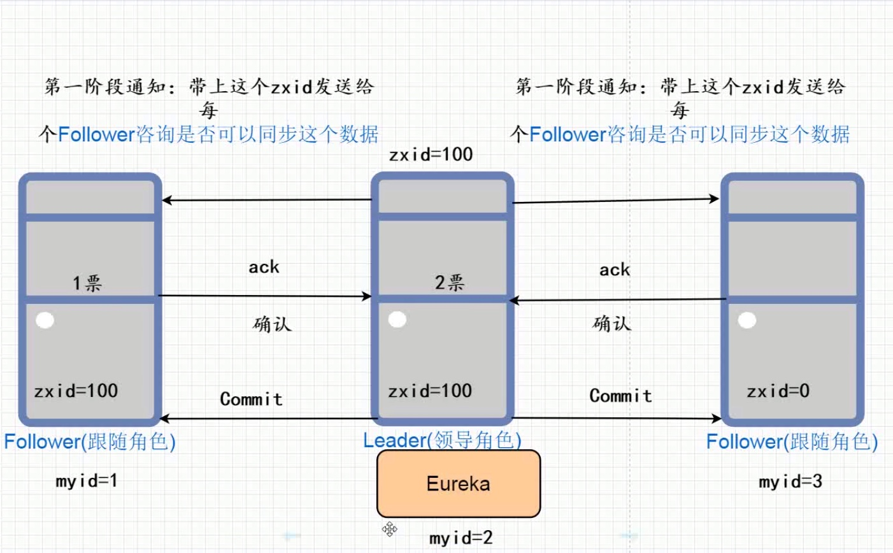

<meta name="referrer" content="no-referrer" />

### 分布式事务一致性框架与分布式系统一致性算法
**分布式事务一致性框架：** 核心就是解决我们在实际系统中产生跨事务导致分布式事务的问题，核心靠的是最终一致性。比如：rocketMq事务消息、rabbitmq补单、lcn、seata等。
**分布式系统一致性算法：** 解决我们系统之间集群之后每隔节点保持数据的一致性。比如：raft、zab、paxos等
分布式系统一致性算法应用于系统软件实现集群保持每隔节点数据的同步性。保持我们的集群中每个节点的数据的一致性问题。

 

### 相关算法

在集群环境下，如何去进行领导角色的选举？由以下两个选举算法：

#### 1、rap协议
  对每个结点配置一个myid或者serverid，数值越大表示能力越强，或者随机时间
  整个集群中为了保持数据的一致性的问题，必须满足大多数情况下> n/2+1,可运行的节点环境才可以使用
  ZAP的协议实现原理是通过比较myid，myid谁最大谁就最可能是领导角色，只要满足过半的机制就可以成为领导角色，后来启动的节点不会参与选举的。

**ZAP如何保持数据的一致性问题：**
  所有写的请求统一交给我们的领导角色实现，领导角色写完数据之后，领导角色再将数据同步给每个节点。数据之间同步采用**2pc两阶段提交协议**。
  
**选举过程：**
  先去比较zxid，zxid谁最大谁就为领导角色
  如果zxid相等的情况下，myid谁最大谁就为领导角色。

**关于zxid和2pc两阶段提交协议**
  zxid是每个节点都有的一个标记，所有的写请求都是交给主节点去进行操作的，当主节点操作完之后，会将zxid+1，然后同步给其他节点，其他节点确认自己本身能够将自己的zxid实现自增之后将确认信号给到主节点，当主节点全部收到确认信号之后将会通知所有节点进行zxid自增的操作。
  
#### 2、Raft协议

**在Raft协议算法中分为三个角色|名词：**
  - 状态：分为三种：跟随者、竞选者（候选人）、领导角色
  - 大多数：>n/2+1
  - 任期：每次选举一个新的领导角色，任期都会实现增加
  - 竞选者谁的票数最多，谁就是领导角色

**选举的过程是怎么样的？**
  - 默认的情况下每个节点都是位跟随者
  - 每个节点会随机地生成一个选举地超时时间，例如大概是100-300ms，在这个超时时间范围内必须要等待
  - 超时时间过后，当前的节点状态可能由跟随者变为竞选者状态，会给其他的节点发出选举投票的通知，只要该竞选者有超过半数以上的票数即可选为领导角色
  核心的设计原理其实就是靠的谁的超时时间最短谁就有非常大的概率成为领导角色。

**核心设计的原理：**谁超时时间最短谁就有大概率地成为领导角色。

**随机超时时间有可能一样的情况下：**
  1、如果所有地节点的超时随机数都是一样的情况下，当前投票全部作废，重新进入随机生成超时时间的状态
  2、如果由多个节点生成的随机数都是一样的情况下，比较谁的票数最多，谁就是领导。如果票数完全一样的情况，直接作废，重新进入随机生成超时时间的状态。

建议:集群节点设为**奇数**

**故障的重新选举：**
  如果我们的跟随者节点不能够及时地收到领导角色消息，那么这个时候跟随者就会将当前自己的状态由跟随者变为竞选者的角色，会给其他的节点发出选举投票的通知，只要该竞选者有超过半数以上的票数即可选为领导角色。

*疑问：是否可能会产生两个同时的竞选者，同时实现拉票呢？*
    当我们的节点为偶数的情况下，可能会存在该问题，如果两个竞选者获取的票数相等的情况下，开始重置竞选的超时时间，一直到谁的票数最多谁就为领导。

**数据是如何保持一致性的？**
  类似zap两阶段提交协议。

**如何实现日志的复制？**
  - 所有的写的请求都是统一地交给我们的领导角色完成的，写入该对应的日志，标记该日志为被提交状态。
  - 为了提交该日志，领导角色就会将该日志以心跳的形式发送给其他的跟随者，只要满足过半的跟随者可以写入该数据，则会通知其他节点同步该数据，这个称作为日志复制。

