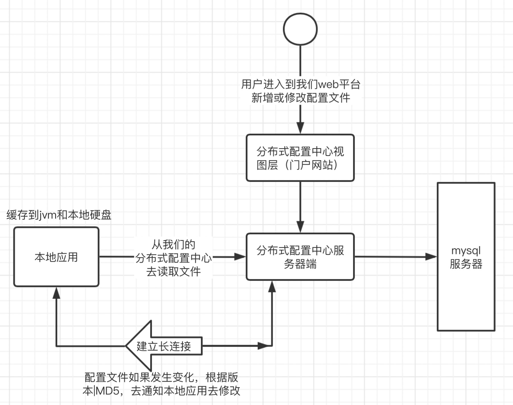
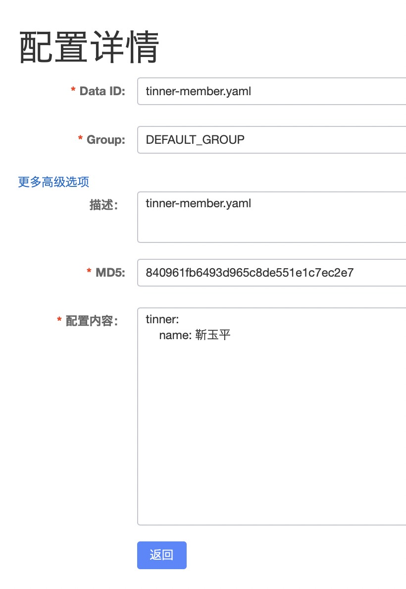
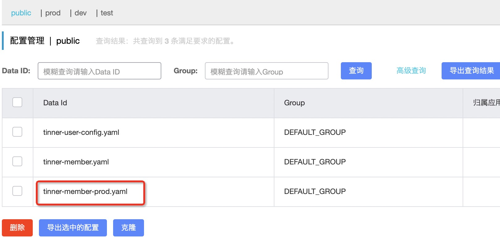
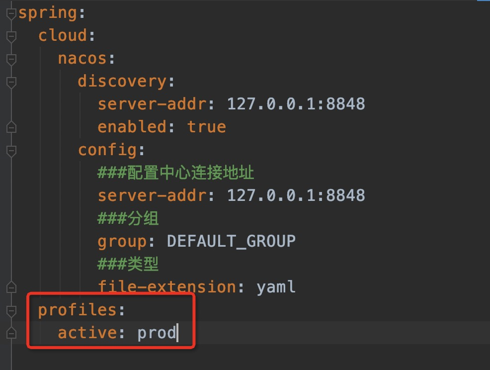

<meta name="referrer" content="no-referrer" />

# 一.分布式配置中心的作用
分布式配置中心可以实现不需要重启我们的服务器，动态的修改我们的配置文件内容，
常见的配置中心有携程的阿波罗、SpringCloud Config、Nacos轻量级的配置中心等。

**轻量级：** 部署、架构设计原理都比较简单，学习成本也比较低。
**重量级：** 部署、架构设计、体积都非常大，学习成本比较高。

<!-- more -->

# 二.原理
1、本地应用读取我们云端分布式配置中心文件（第一次建立长连接）
2、本地应用读取到配置文件之后，本地jvm和硬盘中都会缓存一份
3、本地应用与分布式配置中心服务端一直保持长连接
4、当我们的配置文件发生变化（MD5|版本号）实现区分，将变化结果通知给我们的本地应用及时地刷新我们的配置文件。

完全百分百实现动态化修改我们的配置文件

# 三.代码实现
## 1.新增配置文件


## 2.项目中添加依赖
```
        <dependency>
            <groupId>org.springframework.cloud</groupId>
            <artifactId>spring-cloud-starter-alibaba-nacos-config</artifactId>
            <version>0.2.2.RELEASE</version>
        </dependency>
```

## 3.新建bootstrap.yml
```
spring:
  cloud:
    nacos:
      discovery:
        server-addr: 127.0.0.1:8848
        enabled: true
      config:
        ###配置中心连接地址
        server-addr: 127.0.0.1:8848
        ###分组
        group: DEFAULT_GROUP
        ###类型
        file-extension: yaml
```

## 4.代码
```
@RestController
@RefreshScope
public class UserServiceImpl implements UserService {

    @Value("${tinner.name}")
    private String tinnerName;
    @Override
    public String getUser(Integer userId) {
        return tinnerName + "我是会员服务";
    }
}
```

### 5.注意事项
- 本地如果也配置相同的key，那么在启动的时候可能会抛出异常
- 可以实现动态实现`@RefreshScope`
- nacos在windows版本下运行默认是单机版本 需要指定`startup.cmd -m cluster`
- nacos在linux版本下运行默认是集群版本 如果想连接单机版本 `startup.cmd –m standalone`

### 6.bootstrap与application区别
- bootstrap.yml 用于应用程序上下文的引导阶段。
- application.yml 由父Spring ApplicationContext加载。

# 四.多版本控制

## 1.新增prod配置文件


## 2.修改项目的配置文件


# 五. Nacos集群模式
官方文档：https://nacos.io/en-us/docs/cluster-mode-quick-start.html
视频教程：https://www.bilibili.com/video/BV1D7411A7Ru?p=43
