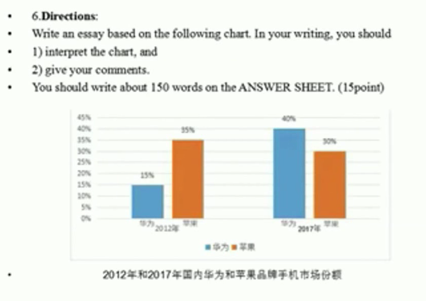

<meta name="referrer" content="no-referrer" />

# 一.历年回顾

过去10年中，柱状图考了5次，饼状图3次，1年的线形图和表格
大纲：还涉及到图表作文的考察

## 总结
核心就是选显著变化的对象来进行中心思想的选择
时间安排：20-25分钟

# 二.写作及要求

## 2.1 审题

题目要求：
- 1.对数据的解读
- 2.给出自己的评论

柱状图是最重要的，在分析过程中，要研究出主要变化的趋势，从积极乐观的角度去分析对国民有益的对象。

## 2.2整体要求

阅卷老师对作文的要求有：
- 1.内容；完整性和连贯性
- 2.语言：准确性和多样性
- 3.语篇：自然段逻辑清晰
- 4.卷面的整洁
- 5.书写工整

# 三.写作技巧

## 3.1 字数及段落

三段，200词左右，不写标题！不写标题！不写标题！

## 3.2 段落的句子安排
### 第一段：
	
一般写三个句子
- 第一句：要具有概括性，对数据的宏观解读
>【bar chart（柱状图）清晰地揭示了xx和xx在xxx方面发生了显著的变化。】
- 第二句：写非主要讨论的那一方的变化。结束之后用However等转折词对第三句进行过渡
- 第三句：写主要讨论的那一方的变化。

### 第二段：
主要写出主要讨论的对象之所以成这种走向变化的原因，一般写四句
- 第一句：xxx在xx方面发生这一变化（产生这种趋势）是有各方面原因的（然后延伸出3~4点进行表述）
- 第二~第四句从各个角度表达出产生这种趋势（trend、tendency）的原因

要注意总分逻辑的对应性，可以适当举例子，但是不要暴露缺点

万能原因：`with the accelerating rate of technological innovation in the xxx industry`

### 第三段：
（最好写1~2句）作者的主观感受都是在最后一段，涉及到了作者的立场和态度，所以最后一段要体现出我们的立场和态度。
两句：评价+结论（或建议）

# 四.示例

## 4.1 题目

## 4.2 作答

The bar chart above demonstrates clearly that significant changes have taken place with respect to the shares of HuaWei and Apple in the domestics smart phone market.In the light of the given information,we can notice that in a mere five years,the market percentage of Apple has decreased a lot,dropping by 5% from 2012 to 2017.At the same time,however,the share of the national brand HuaWei has witnessed a dramatic rise,jumping startling to 40% in the year of 2017.

It is not a difficult job to point out some **influences** accounting for these changes.To start,with the accelerating rate of technological **innovation** in the domestic mobile phone industry,more and more cutting-edge technology has been applied to home-made products,thus enhancing their cost performance and competition fundamentally.Furthermore,the fact cannot be ignored that this phenomenon is bound up with the **transformation** of Chinese consumers' outlook on national brands.Lastly,we may notice,the operator's ingenious marketing **strategies** and the product **optimization** based on our national conditons,produce a contributing effect as well.

Considering the arguments above,we can conclude with confidence that this trend is quite **positive** and therefore **beneficial**.And I firmly believe the tendency in question will keep going in the years to come.

以下文章中有部分错误标识出来了，注意区分

### 第一段

#### 第一句

The bar chart above <u>demonstrate</u> clearly that significant changes <u>happened</u> with respect to the shares of HuaWei and Apple in the domestics smart phone market.
以上柱状图清晰地展示了关于华为和苹果在国内智能手机市场所占份额的显著变化。

##### 生词

|词组|含义|
|---|---|
|with respect to|关于|
|shares|份额|
|demestic|国内的|

##### 纠错

|错误|纠正|
|---|---|
|demonstrate|【动词用法不当】不能用原型，因为是第三人称单数，所以要加s.**demonstrates**|
|happened|【用词不当】表示的是偶然发生，在逻辑层面不能分析偶然发生的事件，可以替换为take place或者arise。用过去式也是错的，解读的东西是根据过去的数据解读出现在的变化，所以**时态应该是现在完成时**。应该为：**have taken place / have arisen**.|

#### 第二句

In the light of the given information,we can notice that in a mere five years,the market percentage of Apple <u>have</u> decreased a lot,dropping by 5% from 2012 to 2017.
根据给定的信息，我们可以注意到，在短短五年内，苹果的市场份额大幅下降，从2012年到2017年下降了5%。

> 逗号之后加伴随状语，所以用动词ing（dropping）

##### 生词

|词组|含义|
|---|---|
|In the light of|根据，依据，按照|
|a mere|= merely 仅仅的|
|dropping by|下降了|

##### 纠错

|错误|纠正|
|---|---|
|have|【动词用法不当】应该改为**has**，因为主语是parcentage百分率|

#### 第三句

At the same time,however,the <u>shares</u> of the national brand HuaWei <u>witnessed</u> a dramatic rise,jumping startling to 40% in the year of 2017.
然而，与此同时，华为的民族品牌份额大幅上升，在2017年跃升至40%。

##### 生词

|词组|含义|
|---|---|
|dramatic|= a lot 令人吃惊的|
|jumping|激增|

##### 纠错

|错误|纠正|
|---|---|
|shares|【名词用法不当】不能用复数，因为是单个品牌的份额，所以用单数share|
|witnessed|【时态问题】应该用现在完成时has witnessed|

### 第二段

#### 第一句

It is <u>not</u> difficult job to point out some **influences** accounting for these changes.
指出以上产生以上变化的影响并不是件难事

##### 生词

|词组|含义|
|---|---|
|accoun for|解释...的原因,解释，说明|
|no|= not any 表否定语气很强|

##### 纠错

|错误|纠正|
|---|---|
|not|not应该换成no，或者not后加a，因为job是可数名词|

#### 第二句

To start,with the accelerating rate of technological **innovation** in the domestic mobile phone industry,more and more cutting-edge <u>technologies</u> has been applied to home-made products,thus enhancing their cost performance and competition fundamentally.
首先，随着国内手机行业技术创新速度的加快，越来越多的尖端技术被应用于国产产品，从而从根本上提高了其性价比和竞争力。

##### 生词

|词组|含义|
|---|---|
|accelerating|加速，加快|
|rate|比率，速度|
|technological|技术的|
|innovation|创新，革新|
|cutting-edge|尖端的，先进的|
|thus|因此，引导结果状语从句的|
|enhance|提高|
|innovation|创新，革新|
|cost performance|性价比|
|competition|竞争力|
|fundamentally|从根本上|

##### 纠错

|错误|纠正|
|---|---|
|technologies|通常是用原型，technology|

#### 第三句

Furthermore,the fact cannot be ignored that this phenomenon is bound up with the **transformation** of Chinese consumers' outlook on national brands.（同位语从句，名词分裂）
此外，不可忽视的事实是，这一现象与中国消费者民族品牌观的转变有关。

##### 生词

|词组|含义|
|---|---|
|Furthermore|adv.此外；而且；再者|
|A is bound up with B |A和B逻辑上密不可分，前果后因|
|bound |= bind的过去分词|
|outlook|观念|

#### 第四句
		
Lastly,we may notice,the operator's ingenious marketing **strategies** and the product **optimization** based on our national conditons,<u>produces</u> a contributing effect as well.（插入结构和并列）
最后，我们注意到，运营人员巧妙的营销策略以及根据我国国情的产品优化，也产生了导致性影响。

> 双逗原则，可有可无

##### 生词

|词组|含义|
|---|---|
|ingenious|adj.精巧的；新颖独特的；巧妙的；心灵手巧的；机敏的；善于创造发明的|
|strategy|策略|
|optimization|n.优化|
|optimum|最佳的；最适宜的；最佳结果；最好的条件|
|operator|运营人员|
|ingenious marketing strategies|巧妙的营销策略|
|contributing|导致性的|
|effect|影响|

##### 纠错

|错误|纠正|
|---|---|
|produces|and连接的两个因素，不应该用produces了，应该用**produce**|

### 第三段

#### 第一句

Considering the arguments above,we can conclude with confidence that this trend is quite **positive** and therefore **beneficial**.
综上所述，我们可以自信地得出结论，即以上这一趋势是积极乐观的，从而是有益处的。

##### 生词

|词组|含义|
|---|---|
|Considering the arguments above |综上所述|
|arguments|争吵、观点、论据、论点|
|conclude that|得出...结论|
|with+n.|相当于副词，经常做方式状语|
|therefore|表示两者之间的因果关系|
|positive|积极乐观的|
|pessimistic|悲观的|

#### 第二句

And I firmly believe the tendency in question will keep going in the years to come.
我坚信这个所探讨的趋势将会在未来的岁月继续持续。

##### 生词

|词组|含义|
|---|---|
|in question|所探讨的|
|in the years to come.|在未来的岁月|

		
			
		
	

		
				
			

	 
	 
	

