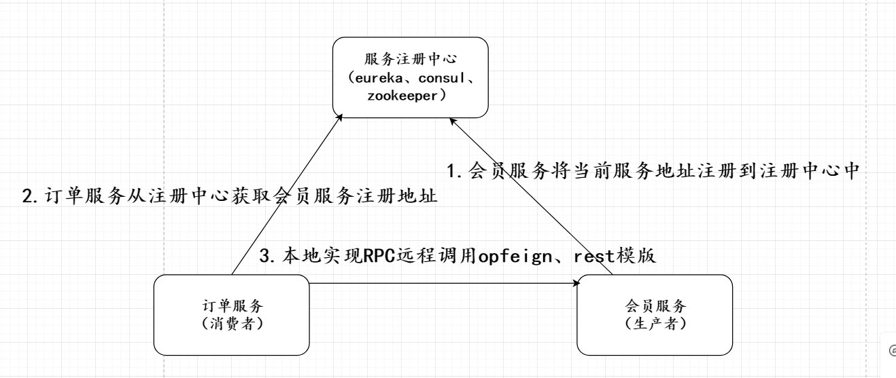

<meta name="referrer" content="no-referrer" />

### 服务治理基本的概念
**服务治理概念：**
在RPC远程调用过程中，服务与服务之间依赖关系非常大，服务Url地址管理非常复杂，所以这时候需要对我们服务的url实现治理，通过服务治理可以实现服务注册与发现、负载均衡、容错等。
**服务注册中心的概念**
每次调用该服务如果地址直接写死的话，一旦接口发生变化的情况下，这时候需要重新发布版本才可以该接口调用地址，所以需要一个注册中心统一管理我们的服务注册与发现。

 

**注册中心：**
我们的服务注册到我们注册中心，key为`服务名称`、value为`该服务调用地址`，该类型为集合类型。常用的注册中心有：Eureka、consul、zookeeper、nacos等。

**服务注册:**
我们生产者项目启动的时候，会将当前服务自己的信息地址注册到注册中心。

**服务发现:**
消费者从我们的注册中心上获取生产者调用的地址（集合），在使用负载均衡的策略获取集群中某个地址实现本地rpc远程调用。

### 微服务调用接口常用名词

**生产者：** 提供接口被其他服务调用
**消费者：** 调用生产者接口实现消费
**服务注册：** 将当前服务地址注册
**服务发现：** 

### Nacos
Nacos可以实现分布式服务注册与发现/分布式配置中心框架。
官网的介绍: https://nacos.io/zh-cn/docs/what-is-nacos.html

Nacos安装及基本操作：https://nacos.io/zh-cn/docs/quick-start.html