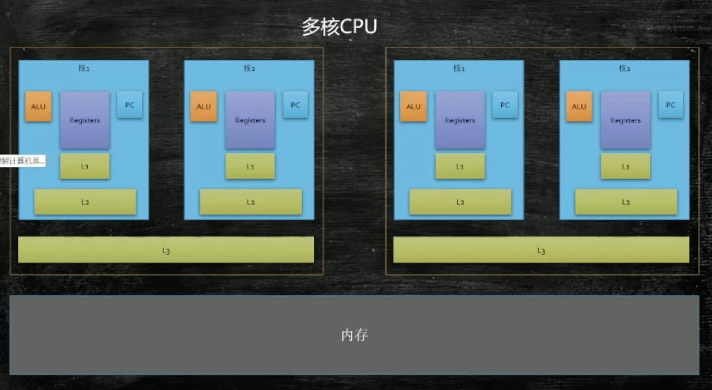

<meta name="referrer" content="no-referrer" />

# 存储器的层次结构
- L0:寄存器（最快、最小、成本最高）
- L1:高速缓存
- L2:高速缓存
- L3:高速缓存
- L4:主存
- L5:磁盘
- L6:远程文件存储
 

# 多核CPUL1、L2、L3缓存和内存结构和读取逻辑

- ALU在读取数据的时候会先从L1中取，L1没有读L2,L2没有读L3,L3还没有则直接从主存中去读。
- L1和L2位于一个CPU核的内部
- 每颗CPU里面有一个三级缓存，在一颗CPU的每个核中是共享的
- 每次拿数据的时候都是按块读取，一块的大小大概是64字节
- 缓存行的概念
