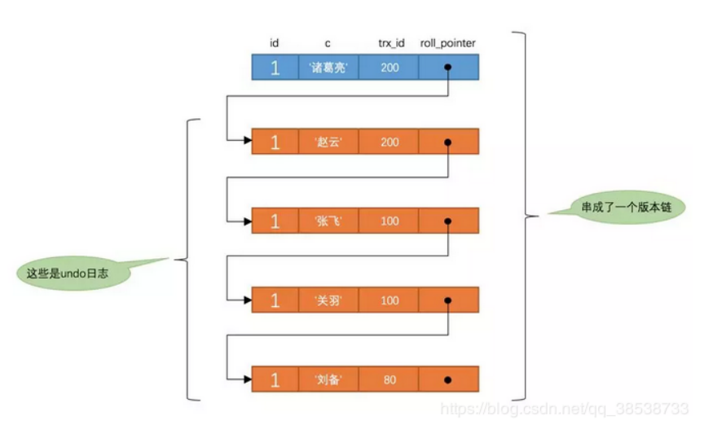
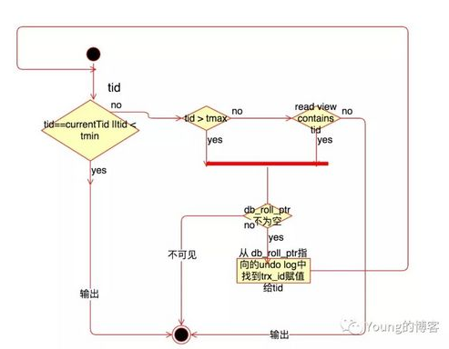
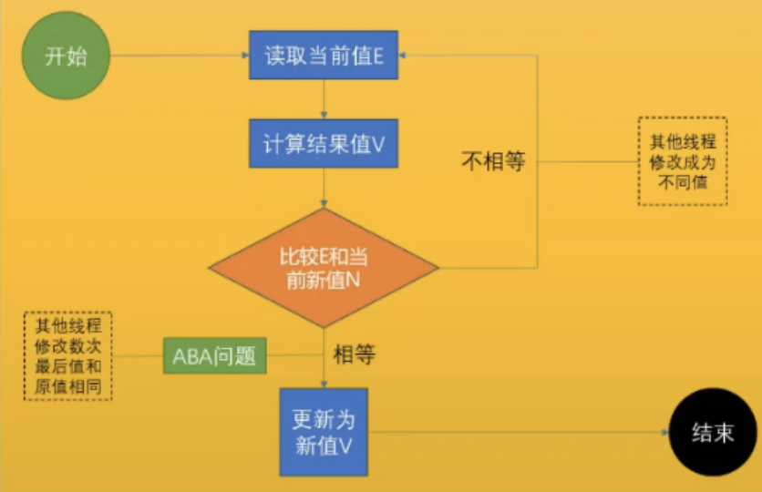

<meta name="referrer" content="no-referrer" />

# 一.基础
## 1.hashmap

HashMap是基于哈希表的Map接口的非同步实现。此实现提供所有可选的映射操作，并且允许null键和null值。不保证顺序。

### 1.1 7与8的区别

hashmap初始容量都是16，扩容因子是0.75倍.当元素的数量达到了`16*0.75=12`的时候，会进行扩容。
底层：数组+链表。数组中的元素存放的是entry的引用

- jdk8中会将链表转化为红黑树（红黑树的查询插入效率介于链表和二叉树之间）
- 新节点插入链表的顺序不同（jdk7是插入头节点，jdk8因为要遍历链表把链表变为红黑树所以采用插入尾结点）
- hash算法简化。因为使用了红黑树，即使散列不均匀查询效率也不会很低。
- resize的逻辑修改（jdk7会出现死循环，jdk8不会），resize方法完成了初始化和扩容。

 
> 1.在put的时候一开始初始化的时候要用比阈值大的2的次方数。

> 2.在hash算法中，首先对其key的hashcode进行抑或操作，目的就是控制散列值在数组size中，但是在抑或之后还要对key的hashcode进行右移，目的就是让其高位参与运算，使得散列更为均匀。

> 3.jdk1.7中在对hashmap进行扩容的时候，由于使用的是头插法，就可能会导致出现死循环的问题，发生死锁。因为1.7是循环遍历，1.8是先判断元素是要放在高位还是低位，然后将low的元素和high的元素分别组合起来放到新的扩容数组中

> 4.jdk1.8当hash相同的链表中的node超过阈值（8）的时候并且数组的长度小于64的时候，会进行扩容；如果数组的长度大于64，会将当前下标指向的这个链表转化为红黑树。

> 5.链表转化为红黑树：先比较key的hashcode；如果相同则去看key有没有实现comparable接口，如果实现了则进行比较；如果没有实现或者相同，则会比较key的class的名字；如果key的className相同则会调同`System.identityHashcode`方法去进行比较jvm内部的hashcode。然后根据插入的元素进行红黑树root节点的调整。一个node节点既是红黑树的节点，同时也是双向链表的节点，因为它继承了hashmap的entry类。扩容的时候遍历双向链表，同样先判断元素是要放在高位还是低位.

### 1.2遍历方式

```
 Iterator<Map.Entry<String, Integer>> entryIterator = map.entrySet().iterator();
         while (entryIterator.hasNext()) {
             Map.Entry<String, Integer> next = entryIterator.next();
             System.out.println("key=" + next.getKey() + " value=" + next.getValue());
         }
 
 Iterator<String> iterator = map.keySet().iterator();
         while (iterator.hasNext()){
             String key = iterator.next();
            System.out.println("key=" + key + " value=" + map.get(key));

        }

```
## 2.Concurrenthashmap
### jdk1.7


如图所示，是由 Segment 数组、HashEntry 组成，和 HashMap 一样，仍然是数组加链表。

它的核心成员变量：

```
   /**
    * Segment 数组，存放数据时首先需要定位到具体的 Segment 中。
    */
   final Segment<K,V>[] segments;
   transient Set<K> keySet;
   transient Set<Map.Entry<K,V>> entrySet;
```

和 HashMap 非常类似，唯一的区别就是其中的核心数据如 value ，以及链表都是 volatile 修饰的，保证了获取时的可见性。

原理上来说：ConcurrentHashMap 采用了分段锁技术，其中 Segment 继承于 ReentrantLock。不会像 HashTable 那样不管是 put 还是 get 操作都需要做同步处理，理论上 ConcurrentHashMap 支持 CurrencyLevel (Segment 数组数量)的线程并发。每当一个线程占用锁访问一个 Segment 时，不会影响到其他的 Segment。

**[put]**
- 将当前 Segment 中的 table 通过 key 的 hashcode 定位到 HashEntry。

- 遍历该 HashEntry，如果不为空则判断传入的 key 和当前遍历的 key 是否相等，相等则覆盖旧的 value。

- 不为空则需要新建一个 HashEntry 并加入到 Segment 中，同时会先判断是否需要扩容。

- 最后会解除在 1 中所获取当前 Segment 的锁

**[get]**

- 只需要将 Key 通过 Hash 之后定位到具体的 Segment ，再通过一次 Hash 定位到具体的元素上。

- 由于 HashEntry 中的 value 属性是用 volatile 关键词修饰的，保证了内存可见性，所以每次获取时都是最新值。

- ConcurrentHashMap 的 get 方法是非常高效的，因为整个过程都不需要加锁。

### jdk1.8
抛弃了原有的 Segment 分段锁，而采用了 `CAS + synchronized` 来保证并发安全性。

也将 1.7 中存放数据的 HashEntry 改为 Node，但作用都是相同的。

其中的 val next 都用了 volatile 修饰，保证了可见性。

**[put]**
- 根据 key 计算出 hashcode 。

- 判断是否需要进行初始化。

- f 即为当前 key 定位出的 Node，如果为空表示当前位置可以写入数据，利用 CAS 尝试写入，失败则自旋保证成功。

- 如果当前位置的 `hashcode == MOVED == -1`,则需要进行扩容。

- 如果都不满足，则利用 synchronized 锁写入数据。

- 如果数量大于 TREEIFY_THRESHOLD 则要转换为红黑树。


**[get]**

- 根据计算出来的 hashcode 寻址，如果就在桶上那么直接返回值。

- 如果是红黑树那就按照树的方式获取值。

- 不满足那就按照链表的方式遍历获取值。

> 1.8 在 1.7 的数据结构上做了大的改动，采用红黑树之后可以保证查询效率（O(logn)），甚至取消了 ReentrantLock 改为了 synchronized，这样可以看出在新版的 JDK 中对 synchronized 优化是很到位的。

## 3.内存相关
### 3.1 对象在内存中的布局：（4部分）
	
- `markword` :标记字，8字节（64位的话，给8字节），记录的是锁信息、hashcode、gc垃圾回收信息
- `class pointer`:类型指针。（创建一个Object类型，就是Object.class）
- `instance data`:实例数据，一个类中的成员变量（8种基本数据类型和引用数据类型）
- `padding`:对齐，为了能够让上述三部分相加起来的字节数能够让8整除，多添加几个字节，目的是为了提高cpu的利用率。

一个Object对象，占16个字节，8个标记字，4个class pointer,还有4个对齐

### 3.2 锁升级

java上的实现都是小端在前，大端在后；网络上的实现都是大端在前

- new出来对象之后，优先上的锁叫偏向锁，偏向第一个进去做事的线程。偏向锁的意思就是当前线程的指针被记录在了markword里面，偏向锁严格来讲不是一把锁，它就是一个标志，表示这个锁归我了。
- 偏向锁不需要锁竞争，只需要第一个来的线程就直接给他上了这个锁，没有竞争，就少了同步，效率就会提升。

**为什么要设计偏向锁？**

设计偏向锁的原因在于提高效率，因为这个锁相当于给了一个标记，标记它不需要去参与竞争。
	
**如果第二个线程来了怎么办？**

1>这个时候锁升级，升级为自旋锁（轻量级锁）。
2>自旋锁又会升级为重量级锁

**那么什么时候自旋锁会升级为重量级锁？**

竞争加剧：有一个线程超过10次自旋，或者自旋线程超过CPU核数的一半，就会升级。1.6之后，加入自适应自旋AdapativeSlefSpinning，JVM自己控制

#### 3.2.1 自旋锁和重量级锁的区别

自旋是发生在用户空间的，它不经过os对线程的调度。一般来讲，只要调用了`wait()`、`notify()`等方法，就进入到了重量级锁的状态了。重量级状态是什么状态呢？这把锁，附着着一个队列，这个队列的专业叫法叫`waitSet`,`waitSet`这里面的线程都是排好队的，等着操作系统调度才能拿到锁，这个`waitSet`就是等待队列。区别就在于，自旋锁是大家相互抢，谁抢着锁算谁的，而重量级锁是大家都进入到一个等待队列中去，等着操作系统老大去进行调度拿锁。自旋锁在等待的时候消耗cpu资源，而重量级锁在等待的时候不需要消耗cpu资源。

#### 3.2.2 偏向锁的时延：

偏向锁是在jvm启动之后的4秒后开始启动，偏向锁启动之后，给对象上的偏向锁都是匿名偏向。`为什么是4秒？`原因是jvm启动的过程一定会有锁竞争，因此就没有必要启动这把偏向锁，等jvm启动之后，再启动偏向锁

#### 3.2.3 偏向锁的效率是不是一定比自旋锁的效率高？打开偏向锁是不是效率一定会提升？

不一定，因为偏向锁是希望没有锁竞争的，但是如果你明明知道会有锁竞争，还去加偏向锁，没有任何意义。

> 注意：偏向锁是锁的类型，可重入锁是锁的机制，两个不是一个概念。

### 3.3 volatile关键字

作用：
- 1、线程间可见
	A线程将变量的值更改了，另一个线程需要知道
- 2、禁止指令重排序
	指令重排序：在程序运行中，可能后面的代码比前面的代码先执行（前提是后面的代码不依赖于前面的代码情况下，为了提高cpu利用率，会这样运行）
	禁止重排序原理：在两条指令中间加了一层屏障：JSR内存屏障（分四种：LoadLoad屏障、StoreStore屏障、LoadStore屏障、StoreLoad屏障）
	load是读，store是写

#### 3.3.1 汇编语言的lock指令:

- 用于在多处理器中执行指令时对共享内存的独占使用
- 它的作用是能够将当前处理器对应缓存的内容刷新到内存，并使其他处理器对应的缓存失效。
- 另外还提供了有序的指令无法越过这个内存屏障的作用。
- lock addl实现了volatile的两个作用


### 3.4 Java和go

- Java的线程和内核线程是一对一的。
- Go的线程和内核是M:N的，而且M远大于N
- Java中的线程池：`forkjoinPool`,每一个线程都有自己的任务队列，但是任务和任务之间它们是不能做同步的，就是说我这个任务执行完了才能执行下一个任务。但是go的routin任务和任务之间是可以同步的，在用户空间模拟了cpu的执行，有类似保存现场恢复现场的功能。

# 二.设计模式
## 1.单例模式

### 1.1 饿汉

- 对外提供一个返回该实例的方法，static用来在jvm启动过程中去创建对象，构造方法私有化，以此来保证在程序运行过程中用到的对象都是只有一个实例。
- 类加载到内存后，就会实例化一个单例，JVM保证线程安全。
- 简单实用，推荐使用。
- 唯一缺点：类装载的时候就完成实例化，不管你是否需要用到它。

### 1.2懒汉：
	
- 什么时候需要用，才会将这个实例给new出来，但是是线程不安全的，因为同一时刻如果多个线程都需要这个实例，产生出来的就不止一个对象，很简单的优化方式就是加synchronized锁，以此来保证只有一个实例。 但是这种锁的粒度太大了，如果在getInstance方法中有业务代码，那么会锁定相关的业务代码。所以就牵涉到一个优化问题
- 引入DCL：double check lock

相关代码如下：
```
public class Mgr01 {

    private static volatile Mgr01 INSTANCE;
    private Mgr01(){
    }
    public static Mgr01 getInstance(){
        if(INSTANCE == null){
            synchronized (Mgr01.class){
                if (INSTANCE == null ){
                    INSTANCE = new Mgr01();
                }
            }
        }
        return INSTANCE;
    }
}
```

DCl不能乱序，所以DCL一定要加volatile。因为在初始化一个对象的时候，在汇编层面有5条指令，大体的流程就是：开辟内存空间->成员变量初始化->引用绑定，之所以要用volatile就是为了不让其指令发生重排序，如果不加的话，可能第二步和第三步发生指令重排序，导致成员没有初始化就将引用绑定给变量了，那么其他线程用这个类的实例的时候就会出现问题。

# 三、存储层

## 1.Mysql

#### 1.1 隔离级别

- 读未提交
    脏读
- 读已提交
    不可重复读
- 可重复度*（mysql默认的隔离级别）
    幻读
- 可序列化

#### 1.2 事务隔离级别实现原理

##### 1.2.1 事务隔离的实现-mvcc，多版本并发控制

在mysql中，不管一个表的数据结构定义成什么样，都会有两个隐藏列：

- trx_id:每次对某条聚簇索引记录进行改动时，都会把对应的事务id赋值给trx_id隐藏列。
- roll_pointer:每次对某条聚簇索引记录进行改动时，都会把旧的版本写入到undo日志中，然后这个隐藏列就相当于一个指针，可以通过它来找到该记录修改前的信息。



**mvcc的流程**

- 1.事务在查询数据之前，会生成数据库系统当前的一个快照（read view），记录并维护系统当前`活跃事务的ID`,快照里面存着的是当前时间`活跃的事务id`
- 2.把快照比作条件用来判断当前事务能够看到哪个版本的数据
- 3.快照是在`查询数据`时生成的。



总结：拿着数据比对版本，而不是拿着版本找数据。
 - 不同的隔离级别底层就是因为他们的快照不一样。
 - 读未提交就是根本没有快照，每次修改了不用提交就是一个新的版本。每次读都是一次全新的搜索
 - 可重复读是在第一次查询数据的时候生成一次快照，只要我还没提交，我就不会改变我的快照，所以叫可重复读。
 - 序列化就是我不存在快照，就是串行执行，没有并发的概念。

#### 1.2 幻读是什么？

- 幻读主要体现在读-写冲突上，而不可重复读主要体现在读-读冲突上
- 比如A事务开启之后，读了4条数据，而B事务同时插入了命中A查询条件中的一条数据。A查询之后进行了update，update语句是不会去管快照的，他会直接从B-tree上去读数据，但是这个时候B-tree上有5条数据，它的快照上还是4条，更新之后再次查询，查出了5条，这种现象就是幻读。
- 为什么是5条？因为在update的时候在trx_id这个隐藏列中有了A事务的事务id，所以在更新之后查询能查得到。

#### 1.3 锁

- 行锁，表锁---->锁的粒度
- 乐观锁，悲观锁---->锁的时机
- 共享锁，排他锁---->锁的兼容性

mysql的官方文档中有`8`种锁模式

- 索引锁
    记录存在与否和事务加锁成功与否无关，如SELECT * FROM user WHERE id = 5 FOR UPDATE，此时id=5的记录不存在，隔壁事务仍然无法插入记录（假设当前自增的主键id已经是4了）。因为锁定的是索引，故记录实体存在与否没关系。
- 间隙锁
- 临键锁
    间隙锁一定是开区间，临键锁是是一个左开右闭的区间
    间隙锁是不互斥的，即两个事务可以同时持有包含共同间隙的间隙锁。
    在RR级别下，如果你使用select ... in share mode或者select ... for update语句，那么InnoDB会使用临键锁，因而可以防止幻读
- 共享锁/排他锁
- 意向共享锁/意向排他锁
    共享锁/排他锁都只是行锁，意向共享锁/意向排他锁属于表锁
    取得意向共享锁/意向排他锁是取得共享锁/排他锁的前置条件
    一个事务在请求共享锁/排他锁时，获取到的结果却可能是行锁，也可能是间隙锁，也可能是临键锁
- 插入意向锁 
    插入意向锁是一种特殊的间隙锁
    两个事务却不能在同一时间内一个拥有间隙锁，另一个拥有该间隙区间内的插入意向锁（当然，插入意向锁如果不在间隙锁区间内则是可以的）
- 自增锁
- 预测锁
    自增锁是一种特殊的表级锁，主要用于事务中插入自增字段，也就是我们最常用的自增主键id。 
    自增锁有3种模式，决定了并发自增时并发的自增语句如何持有锁

# 四.Java底层

## 1.锁

- 引入锁，目的是为了保证数据一致性。
- 锁住的一定是一个对象，而且同一时刻只能有一个线程拥有锁去做业务逻辑处理

## 2.不持有锁的线程怎么办？

- 自旋：轻量级锁。
- 进入等待队列，等待操作系统调度，这个时候是重量级锁。

## 3.synchronized关键字

- 1.在早期1.0~1.2的时候，操作系统会接管对应的线程，是个重量级锁，效率非常低。
- 2.jdk1.5之后，诞生了`JUC`包
- 3.锁升级：偏向锁（没有竞争）--->轻量级锁（重量级锁）--->重量级锁

### 3.1 AtomicInteger

- `incrementAndGet()`用到的就是自旋锁。在这个方法的底层调用的是`compareAndSwapInt`，比较并交换，简写为`CAS`.

**什么叫CAS？**

CAS不需要操作系统的调度，只需要在用户空间即可解决。


### 3.2 CAS两大面试题

#### 3.2.1 ABA问题加版本号即可解决

#### 3.2.2 CAS修改值的时候的原子性问题

- Q:当线程A在判断原值E是否是原值之后，还没有修改之前，如何保证没有其他线程B对其变量进行修改？
- A:CAS在最底层是用`lock cmpxchg`指令来支撑的。在多核cpu下，lock指令是锁总线的作用。最终的CAS实现就是这条指令。

## 4.生成一个对象的过程？

至少需要三步：
- 1.申请内存空间，用来装new出来的对象。
- 2.调用构造方法，从默认值变成初始值，此时是半初始化状态
- 3.建立引用连接

## 5.happens-before原则（JVM规定重排序必须遵守的原则）

- `as if serial`:不管如何重排序，单线程执行结果不会改变


